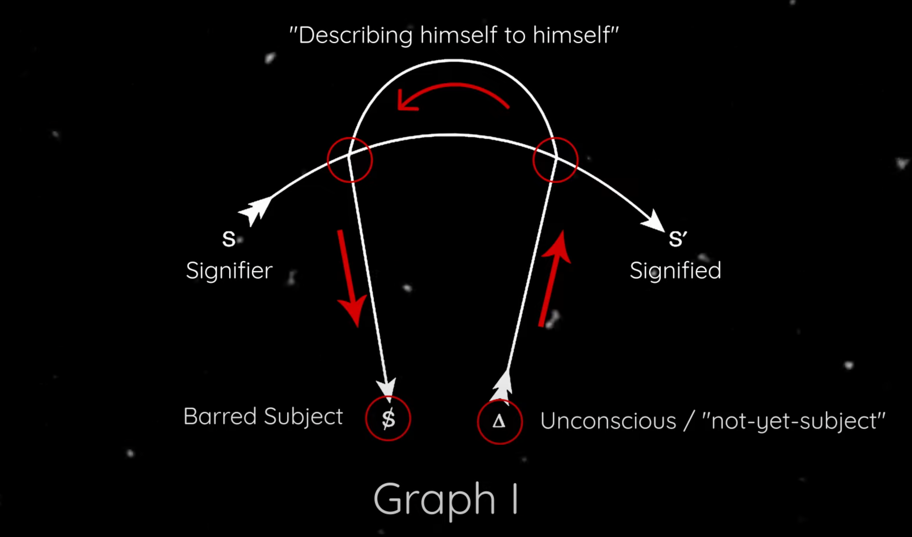
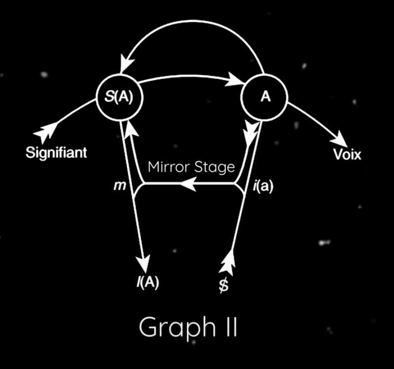
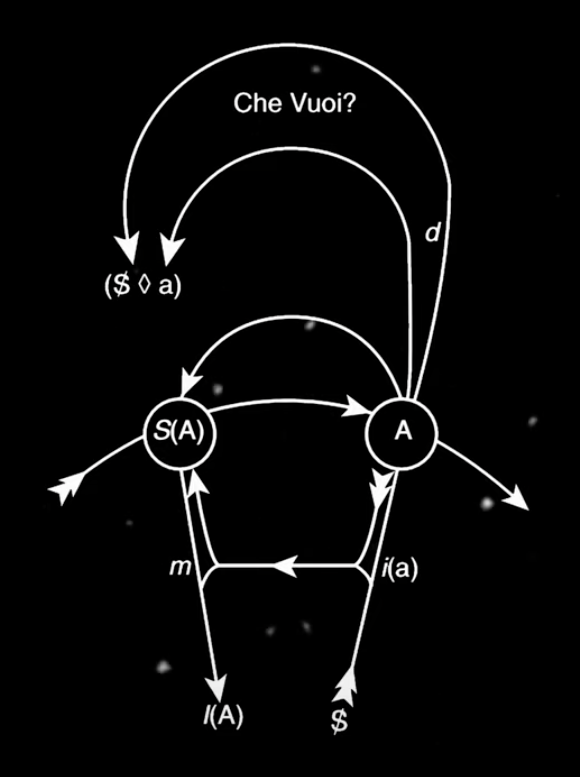

# The Sublime Object Of Ideology - #Zizek

## Preface to New Edition: The Ideas's Constipation

- quote #Hegel : "Die Statuen sind jetzt nur noch Steine, von denen die lebendige Seele ausgeflogen ist, wie die Hymnen Worte sind, aus denen der Glaube geschwunden ist."

## Introduction

- #Habermas - #Foucault vs #Althusser :  individual agency vs ideological interpellation
  - #Habermas and #Foucault allow room for individual agency, while #Althusser sees individuals as deeply influenced by unavoidable structural forces.
    - #Althusser : Ideological interpellation is the process where individuals identify themselves based on societal norms, beliefs, or ideologies. When individuals do this, they often think their identity has always existed, creating an illusion of "I was already there".
      - #Althusser 's "ethics of alienation" suggests that individuals' identities are shaped by uncontrollable societal forces.
- #Lacan vs #Marx (or Post- #Marx) : unsolvable persistent gap vs "if you solve the main conflict you will solve all problems"
  - #Lacan 's "ethics of separation" proposes a persistent gap between reality and our understanding of it, driving desire.
    - #Lacan 's idea of a perpetual, unsolvable tension.
    - #Lacan -ian psychoanalysis transcends the usual post- #Marx -ist anti-essentialist perspective. It posits that while there appear to be multiple unique struggles, these are all in fact responses to the same ungraspable core of reality.
  - traditional #Marx -ism, which posits that a main social conflict shapes all others and can be solved. #Marx -ist idea: the cause of a problem can also be its solution
    - #Marx -sism: If you solve the main problem capitalism you can solve all other problems
    - Post- #Marx -ism examples: feminism/democracy/ecology if you solve the main problem you can solve all other problems
- #Laclau and #Mouffe 's idea of "radical democracy" involves acknowledging and navigating the inherent conflicts and impossibilities within society, rather than trying to find a final, complete solution. This represents a significant departure from traditional #Marx -ist thought.
- #Hegel 's philosophy accepts conflict as an inherent part of reality and identity, and that attempts to completely reconcile or overcome this conflict will always fail. This is a stark contrast to #Marx -ism, which aims for a complete and total reconciliation of societal conflict.

### Aim of the book

1. The book introduces #Lacan -ian psychoanalysis, aligning #Lacan with rationalism and the Enlightenment.
2. It revitalizes #Hegel -ian dialectics through a #Lacan 'ian lens, highlighting #Hegel 's emphasis on difference and loss.
3. It aims to broaden the understanding of ideology through fresh interpretations of classical motifs and key #Lacan 'ian concepts.

Using #Lacan to interpret #Hegel can provide a new perspective on ideology, helping understand modern issues like cynicism and 'totalitarianism' or fragile status of democracy without falling into 'post-modernist' misconceptions (such as the illusion that we live in a post-ideological condition)

---
---

## PART 1 THE SYMPTOM

### 1. How Did #Marx Invent the Symptom?

#### #Marx , #Freud : the analysis of form

- According to #Lacan #Marx invented the notion of symptom
- Homology between #Marx commodities and #Freud dreams: The point is to avoid the fascination of the 'content' hidden behind the form and focus on the form itself
- Dream has three elements:
  - 1. manifest dream-text
  - 2. latent dream-content or thought
  - 3. unconscious desire => attaches itself in the form of a dream
- Two stages of processing #Freud => Dream (analog Commodity #Marx )
  - 1. Conceive dream as a meaningful phenomenon, as something transmitting a repressed message which has to be discovered by an interpretative procedure
  - 2. Avoid the fascination of hidden meaning of the dream and focus on the form itself, on the dream-work to which the latent dream thoughts were submitted

> [How does unconscious desire attach itself in the form of a dream?](2023-10-31_chatgpt_form_of_dream_Zizek_Sublime.md)

#### The unconscious of the commodity-form

- #Marx analysis of the commodity-form offers a kind of matrix enabling us to generate all other forms of the 'fetishistic inversion'
- #Sohn-Rethel - Commodity Exchange
  - the categories and concepts used in scientific procedures are already present and actively operating within the social practice of commodity exchange.
  - the transcendental subject, central to a priori categories, is dependent on worldly processes, akin to the scandalous nature of the #Freud -ian unconscious, with "real abstraction" in commodity exchange serving as the unconscious counterpart for the subject supporting scientific knowledge.
  - Real abstraction, particularly in relation to the act of exchange, should not be understood as a mental process or thought within the thinking subject, but rather as an external concept that takes the form of thought.
  - Examples for the postulate of effective act of exchange
    - 'I know very well, but still...'
    - 'I know that Mother has not got a phallus, but still ... [I believe she has got one]'
    - 'I know that Jews are people like us, but still ... [there is something in them]'
    - 'I know that money is a material object like others, but still ... [it is as if it were made of a special substance over which time has no power]'
      - material of money + sublime material of that other "indestructible and immutable" body => Body within the body => definition of the **sublime object**
  - one definition of unconscious: *the form of thought whose ontological status is not that of thought*
  > The unconscious is a form of thought influenced by the symbolic order, hidden within the subject's conscious thoughts.
  - the form of the thought previous and external to the thought - in short: **the symbolic order**
  - old oriental formula: "thou art that" => "You are the universal conscious"
  - The act of exchange, the action alone, is abstract. The abstractness of that action cannot be noted when it happens because the subjects are focused on their business and the empirical appearance of things.
    - abstractness of the exchange action is beyond realization by the actors because their very consciousness stands in the way
    - if the actors would be aware of the abstractness of their action, the action would not be exchange anymore and the abstraction would not arise
  - The subject who is doing the exchange act overlooks the inter-subjective dimension of his act and is reducing it to a casual encounter of atomized individuals in the market.
    - this repressed social dimension of the act emerges as universal Reason turned towards the observation of nature (natural science)
  - this non-knowledge of the reality is part of its very essence
- abstract concepts like pure quantity, pure abstract movement, and pure reason were already present and operational in concrete phenomena such as money, social exchange, and the transfer of property before they were formally articulated in scientific and philosophical terms.
- if we know too much, to pierce the true functioning of social reality, this reality would dissolve itself
- "ideological" is a social reality whose very existence implies the non-knowledge of its participants as to it's essence -> **the subjects do not know what they are doing**
- **symptom**s: a formation whose very consistency implies a certain non-knowledge on the part of the subject: the subject can enjoy his symptom only in so far as it's logic escapes him - the measure of the success of its Interpretation is precisely it's dissolution.

#### The social symptom

- Ideologies has symptoms: Every ideological Universal is 'false' in so far as it necessarily includes a specific case which breaks its unity, lays open its falsity.
  - Example: Freedom (freedom of speech, press, consciousness, commerce ...)
    - symptom: paradoxical freedom which is the very opposite of effective freedom: worker sells his labour 'freely' and loses his freedom
- Utopian conveys a belief in the possibility of a universality without symptoms => without the point of exception functioning as its internal negation

#### Commodity fetishism

- Marxian notion of commodity fetishism is the idea that in capitalism, goods are seen as having inherent value, concealing the labor and social relations that produce them.
- relation between things <-> relation between men <-> #Lacan 'ian mirror stage
  - relation between things: Commodity A can express its value only by referring itself to another commodity B => the body of B becomes for A the mirror of its value
  - relation between men: Since men comes into the world only establishes his own identity as a man by first comparing himself to another man as being of like him
  - #Lacan 'ian mirror stage: only by being reflected in another man - that is, in so far as this other man offers it an image of its unity - can the ego arrive at its self-identity
    - identity and alienation are thus strictly correlative
- #Hegel 's reflex-categories
  - Example: man is king only because other men stand in the relation of subject to him. They, on the contrary, imagine that they are subjects because he is king.
- in societies in which commodity fetishism reigns (capitalism), the relation between men are totally defetishized, while in societies in which there is fetishism in relations between men (pre-capitalism) commodity fetishism is not yet developed
  - fetishism in relations with men => relations of domination and servitude -> Lordship and Bondage in a #Hegel 'ian sense
    - The place of fetishism has shifted from inter-subjective relations to relations 'between things'

#### Totalitarian laughter

- In contemporary societies, democratic or totalitarian, that cynical distance, laughter, irony, are part of the game, The ruling ideology is not meant to be taken seriously or literally. Perhaps the greatest danger for totalitarianism is people who take its ideology literally.

#### Cynicism as a form of ideology

- #Marx definition of ideology: "Sie wissen das nicht, aber sie tun es"
  - such a naive consciousness can be submitted to a critical-ideological procedure. The aim of it is to lead the naive ideological consciousness to a point at which it can recognize the social reality it is distorting, and through this very act dissolve itself.
  - metaphors of demasking are not correct -> We wake up from an ideology into another ideology
- Nowadays ideology is more like "They know very well what they are doing, but still, they are doing it" (Peter #Sloterdijk )
  - traditional critique of ideology no longer works -> We can no longer subject the ideological text to symptomatic reading, confronting it with its blank spots,... => Because cynical reason takes this distance into account in advance. => Are we living in a post-ideological world? NO! -> distinction between symptom and fantasy must be introduced

#### Ideological fantasy

- Where is the illusion in "Sie wissen das nicht, aber sie tun es" -> The illusion is not on the side of knowledge, it is already on the side of reality itself, of what the people are doing.
- What they do not know is that their social reality itself, their activity, is guided by an illusion, by a fetishistic inversion.
- ideological fantasy: overlooked, unconscious illusion: They know very well how things really are, but still they are doing it as if they did not know -> overlooking the illusion which is structuring our real, effective relationship with reality.
- if we would see the illusion on the "knowing" side => Than we would accept that we live in post-ideological world because people no longer believe in ideological truths
- The fundamental level of ideology, however, is not that of an illusion asking the real state of things but that of an (unconscious) fantasy structuring our social reality itself. => We are far away from post-ideological society
- "They know that, in their activity, they are following an illusion, but still, they are doing it"

#### The objectivity of belief

- feudalism: relations between men are mystified
- capitalism: subjects are emancipated, perceiving themselves as free form medieval religious utilitarians, guided only by their selfish interests
- The point of #Marx 's analysis is that the things (commodities) themselves believe in their place, instead of the subjects => They no longer believe, but the things themselves believe for them
- usual thesis: belief is something interior and knowledge is something exterior
- #Lacan => belief is radically exterior, embodied in the practical, effective procedure of people
  - example: Tibetan prayer wheels: you write a prayer on a paper, put the rolled paper into a wheel, and turn it automatically, without thinking => The wheel is praying for me - I myself am praying through the medium of the wheel. I can think about whatever I want.
  - the most intimate beliefs and emotions such as compassion, crying, sorrow, laughter can be transferred, delegated to others w/o losing their sincerity
    - Examples: People in Egypt get payed for crying in funerals or laughter and applause sounds in comedy tv shows
- Joke: A fool thought he was a grain of corn. After some time in a mental hospital, he was finally cured: now he knows that he was not a grain but a man. So they let him out; but soon afterwards he came running back, saying: "I met a hen and I was afraid she would eat me." The doctors tried to calm him: "But what are you afraid of? Now you know that you are not a grain but a man." The fool answered:"Yes, of course, I know that, but does the hen know that I am no longer a grain?"

#### Law is law

- Belief is far from being an "intimate" purely mental state, is always materialized in our effective social activity: belief supports the fantasy which regulates social reality.
- #Lacan 'ian definition of unconscious: the automaton, which leads the mind unconsciously with it
  - it follows, from this constitutively senseless character of the law, that we must obey it not because it is just, good or even beneficial, but simply because it is the law
- The only real obedience, then, is 'external' one: obedience out of conviction is not real obedience because it is already 'mediated' through our subjectivity
  - #Kierkegaard wrote that to believe in Christ because we consider him wise and good is ad dreadful blasphemy
  - the crucial religious experience is that the reason for belief reveal themselves only to those who already believe - we find reasons attesting our belief because we already believe; we do not believe because we have found sufficient good reasons to believe. => vicious circle of beliefe => transference
- #Pascal final answer: leave rational argumentation and submit yourself simply to ideological ritual, stupefy yourself by repeating the meaningless gestures, act as if you already believe, and the belief will come by itself.
- Quote from a movie: "You are not a Communist because you understand #Marx, you understand #Marx because you are a Communist"

#### #Kafka, critic of #Althusser

- #Lacan dream about the 'burning child'
  - usual interpretation: stimulus coming from reality (ringing of an alarm clock, knocking on the door, in the case of the dream: smell of smoke). and to prolong his sleep he quickly spot, constructs a dream: a little scene, a small story, which includes this irritating element. External irritation becomes too strong and the subject is awakened.
  - #Lacan 'ian reading: the subject does not awake himself when the external irritation becomes too strong; After he prolongs his sleep he encounters in the dream the reality of his desire, the #Lacan 'ian Real - in this case, the reality of the child's reproach to his father. Fathers fundamental guilt is more terrifying than so-called external reality itself, and that is why he awakens: to escape the Real of his desire, which announces itself in the terrifying dream.
- The function of ideology is not to offer us a point of escape from our reality but to offer us the social reality itself as an escape from some traumatic, real kernel.
- #Lacan -> The only point at which we approach this hard kernel of the Real is indeed the dream. When we awaken into reality after a dream, we usually say to ourselves "it was just a dream", thereby blinding ourselves to the fact that in our everyday, wakening reality wer are nothing but a consciousness of his dream. It was only in the dream that we approached the fantasy-framework which determines our activity, our mode of acting in reality itself.
- Example Zhuang-Zi butterfly -> #Lacan : The question, the dialectical split, is possible only when we are awake.

#### Fantasy as a support of reality

- #Lacan thesis: Only in the dream we come close to the real awakening - that is, to the Real of our desire
- #Lacan - last support of what we call "reality" is a fantasy
  - there is always a hard kernel, a leftover which persists and cannot be reduced to a universal play of illusory mirroring.
- #Lacan - the only point at which we approach this hard kernel of the Real is indeed the dream -> it was only in the dream that we approached the fantasy framework which determines our activity, our mode of acting in reality itself
- same with the ideological dream -> the only way to break the power of our ideological dream is to confront the Real of our desire which announces itself in this dream.
- jealous husband -> even if it is true that his wife is sleeping with other men -> this does not change one bit the fact that his jealousy is a pathological, paranoid construction
- An ideology really succeeds when even the facts which at first sight contradict it start to function as arguments in its favour
  - example: Anti-semitism -> good known jew neighbor -> they are really dangerous, look how they are hiding there evil nature behind the mask of everyday appearance

#### Surplus-value and surplus-enjoyment

- ideological perspective
  - #Marx ideological gaze is a partial gaze overlooking the totality of social relations
  - #Lacan 'ian perspective ideology rather designates a totality set on effacing the traces of its own impossibility
- fetish
  - #Marx - fetish conceals the positive network of social relations
  - #Freud - fetish conceals the lack ('castration') around which the symbolic network is articulated
- another difference
  - #Marx - *false eternalization and/or universalization*: aim of 'criticism of ideology' is to denounce the false universality, to detect behind man in general the bourgeois individual
  - #Lacan - *over-rapid historicization*
- the evolutionist reading of the formula of capital as its own limit is inadequate: the point is not that, at a certain moment of its development, the frame of the relation of production starts to constrict further development of the productive forces; the point is that it is this very immanent limit, this 'internal contradiction', which drives capitalism into permanent development. The 'normal' state of capitalism is the permanent revolutionizing of its own conditions of existence.
- paradox: capitalism is capable of transforming its limit, its very impotence, in the source of its power - the more it 'putrefies', the more its immanent contradiction is aggravated, the more it must revolutionize itself to survive. => surplus-enjoyement

### 2. From Symptom to Sinthome

#### The Dialectic of the Symptom

##### Back to the future

- symptom -> 'return of the repressed'
- The #Lacan 'ian answer to the question 'From where does the repressed return?' is therefore, paradoxically, 'From the future'. Symptoms are meaningless traces, their meaning is not discovered, excavated from the hidden depth of the past, but constructed retroactively - the analysis produces the truth; that is, the signifying frame which gives the symptom their symbolic place and meaning.
- Every historical rupture, every advent of a new master-signifier, changes retroactively the meaning of all tradition, restructures the narration of the past, makes it readable in another, new way.
- knowledge about the meaning of our symptoms - what is it, then, it not the transference itself?
- The past exists as it is included, as it enters (into) the synchronous net of the signifier - that is, as it is symbolized in the texture of the historical memory - and that is why we are all the time 'rewriting history', retroactively giving the elements their symbolic weight by including them in new textures - it is this elaboration which decides retroactively what they 'will have been'.
- symptom as a 'return of the repressed' is an effect which precedes its cause (its hidden kernel, its meaning), and in working through the symptom we are 'bringing out the past' - we are producing the symbolic reality of past, long-forgotten traumatic events.
- Transference is, then, an illusion, but the point it that we cannot bypass it and reach directly for the Truth: the Truth itself is constituted through the illusion proper to the transference - 'the Truth arises from misrecognition' #Lacan
- self-fulfilling prophecy - examples
  - William #Tenn 's story 'The Discovery of Morniel Mathaway'
  - Appointment in Samarra - Death, merchant and his servant
  - Myth of Oedipus

##### Repetition in History

- the subjective 'mistake', 'fault', 'error', misrecognition, arrives paradoxically before the truth in relation to which we are designating it as 'error', because the 'truth' itself becomes true only through the error.
- the unconscious is an overlooking: we overlook the way our act is already part of the state of things we are looking at, the way our error is part of the Truth itself.
- The transference is an essential illusion by means of which the final Truth (the meaning of a symptom) is produced.
- #Hegel 's theory of the role of repetition in history: 'a political revolution is generally sanctioned by the opinion of the people only when it is renewed'. -> it can succeed only as a repetition of a first failed attempt.
  - repetition is the way historical necessity asserts itself in the eyes of 'opinion'
- historical necessity itself is constituted through misrecognition, through the initial failure of 'opinion' to recognize its true character - that is, the way truth itself arises from misrecognition
- when the symbolic status of an event erupts for the first time it is experienced as a contingent trauma, as an intrusion of a certain non-symbolized Real; only through repetition is this event recognized in its symbolic necessity - it finds its place in the symbolic network; it is realized in the symbolic order.
- Example: Caeser's murder -> first caeser Augustus: the event did not repeat itself because of some objective necessity, independent of our subjective inclination and thus irresistible, but because its repetition was a repayment of our symbolic debt (guilt).
- the event which repeats itself receives its law retroactively, through repetition.
- #Hegel 'ian repetition can be grasped
  - as a passage from lawless series to a lawlike series,
  - as the inclusion of a lawless series -
  - as a gesture of interpretation par excellence, as a symbolic
  - as a symbolic appropriation of a traumatic, non-symbolized event
  - note: according to #Lacan - interpretation always proceeds under the sign of the Name-Of-The-Father
- #Hegel articulated the *delay* which is constitutive of the act of interpretation: the interpretation always sets too late, with some delay, when the event which is to be interpreted repeats itself; the event cannot be lawlike in its first advent

##### #Hegel with #Austen

- Example for truth arising from misrecognition - *Pride and Justice* from Jane #Austen - Pride Darcy and Prejudice Elizabeth marry at the end after refusing each other first
  - If we want to spare ourselves the painful roundabout route through the misrecognition, we miss the Truth itself: only the 'working-through' of the misrecognition allows us to accede to the true nature of the other and at the same time to overcome our own deficiency
  - Darcy's pride is not existing independently of his relationship to Elizabeth; it appears only from the perspective of her prejudices vice versa, Elizabeth is a pretentious empty minded girl only in Darcy's arrogant vies.

##### Two #Hegel 'ian jokes

- Joke 1: Jew and the pole
- Joke 2: The man and the doorkeeper

##### A time stamp

- misrecognition possesses in itself a positive ontological dimension: it founds, it renders possible a certain positive entity.
- the unconscious is a paradoxical letter which insists only in so far as it does not exist ontologically
- #Lacan 'ian notion of its own conditions: this self exists only on the basis of the misrecognition of its own conditions, it is the effect of this misrecognition
- the subject can pay for such a reflection with the loss of his very ontological consistency
- It is in this sense that the knowledge which we approach through psychoanalysis is impossible-real: we are on dangerous ground. in getting too close to it we observe suddenly how our consistency, our positivity, is dissolving itself.
- in psychoanalysis, knowledge is marked by a lethal dimension: the subject must pay the approach to it with his own being.
- to abolish the misrecognition means at the same time to abolish, to dissolve, the 'substance' which was supposed to hide itself behind the form-illusion of misrecognition.
- This 'substance' is enjoyment [jouissance]: access to knowledge is then paid with the loss of enjoyment - enjoyment, in its stupidity, is possible only on the basis of certain non-knowledge, ignorance.
- No wonder, then, that the reaction of the analysand to the analyst is often paranoid: by driving him towards knowledge about his desire, the analyst wants effectively to steal from him his most intimate treasure, the kernel of his enjoyment.

#### Symptom as Real

##### The Titanic as symptom

- This dialectics of overtaking towards the future and simultaneous retroactive modification of the past - dialectics by which the error is internal to the truth, by which the misrecognition possesses a positive ontological dimension - hast its limits. The limits it the Real, that which resists symbolization
- the traumatic point which is always missed but always returns, although we try to neutralize it, to integrate it into the symbolic order.
- symptom is conceived as a real kernel of enjoyment
- designate strategies to domesticate the slums as a symptom of our cities
- The Titanic is a Thing in #Lacan 'ian sense: the material leftover, the materialization of the terrifying, impossible jouissance
- The wreck of the Titanic therefore functions as a sublime object: a positive, material object elevated to the status of the impossible Thing.

##### From symptom to sinthome

- Das Sinthome ist jener Teil des Symptoms, der den Kern des Subjekts bildet #Lacan
- Everything becomes a Sympthom for #Lacan
  - Why is there something instead of nothing? This 'something' which 'is' instead of nothing is the symptom.
- At the beginning the symptom was conceived as a symbolic, signifying formation, as a kind of cypher, a coded message addressed to the big Other which later was supposed to confer on it its true meaning
- The symptom arises where the world failed, where the circuit of the symbolic communication was broken
- There is no symptom w/o its addressee
- There is no symptom w/o transference, w/o the position of some subject presumed to know its meaning
- Precisely as an enigma, the symptom announces its dissolution through interpretation
- In spite of its interpretation, does the symptom not dissolve itself, because of enjoyment
- The symptom it not only a cyphered massage, it is at the same time a way for the subject to organize his enjoyment
- The symptom does not dissolve because the subject loves his symptom more than himself
- interpretation of symptoms vs going through fantasy
  - symptom can be analyzed
  - fantasy cannot be analyzed - it resists interpretation
  - symptom implies and addresses some non-barred, consistent big Other which will retroactively confer on its meaning
  - fantasy implies a crossed-out, blocked, barred, non-whole, inconcistent Other - it is filling out a void in the Other
  - Symptom causes disconfort and displeasure when it occurs, but we embrace its interpretation with pleasure
    - example: a slip of the tongue - we explain gladly to tohers the meaning of our slips; their intersubjective recognition is usually a source of intellectual satisfaction.
  - When we abondon ourself to fantasy we feel immense pleasure, but on the contrary it causes us great discomfort and shame to confess our fantasies to others
    - example: daydreaming
- Sinthome: Symptom which does not dissolve after interpretation and persists beyond fantasy -> our only substance -> the only point that gives consistency to the subject
- Symptom is the way the subjects avoid madness
- If the symptom in this radical dimension is unbound, it means literally the end of the world - the only alternative to symptom is nothing
- Final definition of the end of the psychoanalytic process according #Lacan is: identification with the symptom -> you must recognize the element which gives consistency to your being

##### In you more than yourself

- The wound is Amfortas's symptom; 'Here I am - here is the open wound!'; all his being is in this wound, if we annihilate it, he himself will lose his positive ontological consistency and cease to exist
- The wound is 'a little piece of real', which is 'in Amfortas more than Amfortas'
- It is destroying him, but at the same time it is the only thing which gives him consistency. This is the paradox of the psychoanalytic concept of the symptom
- JOKE: Editor gets the question why he did not want to go on his holidays. Editor:'O a, afraid that if I were absent for a couple weeks, the sales of the newspaper would fall; but I am even more afraid that in spite of my absence, the sales would not fall!'
  - This is the symptom: an element which cause a great deal of trouble, but its absence would mean even greater trouble: total catastrophe.
- From this perspective of sinthome, truth and enjoyment are radically incompatible: the dimension of truth is opened through our misrecognition of the traumatic Thing, embodying the impossible jouissance.

##### Ideological jouissance

- #Marx 'ian formula of capital itself as the limit of capitalism
- #Lacan - the limit of Enlightenment is Enlightenment itself
- #Kant - 'Reason about whatever you want and as much as you want - but obey!'
  - as the autonomous subject of theoretical reflection, addressing the enlightened public, you can think freely, you can question all authority; but as a part of the social 'machine' as a subject in the other meaning of the word, you must obey unconditionally the orders of your superiors.
- #Descartes - the very first rule emphasizes the need to accept and obey the customs and laws of the country into which we were born without questioning their authority.
  - through acceptance of the fact that 'Law is Law', we are internally freed from ist constraints - the way is open for free theoretical reflection.
- fascist ideology: Obey, because you must! In other words, renounce enjoyment, sacrifice yourself and do not ask about the meaning of it - the value of the sacrifice lies in its very meaninglessness;
  - Question to #Mussolini - What is your program? 'Our programme is very simple: we want to rule Italy!'
  - The ideological power of Fascism lies in the feature which was perceived by liberal or leftist critics as its greatest weakness: in the utterly void, formal character of its appeal, in the fact that it demands obedience and sacrifice for their own sake.
  - Fascism was terrified by psychoanalysis: psychoanalysis enables us to locate an obscene enjoyment at work in this act of formal sacrifice.
- #Descartes - travelers, who are finding themselves lost in a forest -> they should continue to walk as straight as they can in one direction
- **Essence of the chapter** ideological paradox
  - the important thing of ideology is its form
    - we continue to walk as straight as we can in one direction, that we follow even the most dubious opinions once our mind has been made up regarding them;
  - this ideological attitude can be achieved only as a 'state that is essentially by product:
    - the ideological subjects, 'travellers lost in a forest', must conceal from themselves the fact that 'it was possibly chance alone that first determined them in their choice'
    - they must believe that their decision is well founded, that it will lead to their Goal.
  - As soon as they perceive that the real goal is the consistency of the ideological attitude itself, the effect is self-defeating.
  - We can see how ideology works in a way exactly **opposed** to the popular idea of Jesuit morals: the aim here is to justify the means.
  - Why must this inversion of the relation of aim and means remain hidden, why is its revelation self-defeating? Because it would reveal the enjoyment which is at work in ideology, in the ideological renunciation itself. In other words, it would reveal that ideology serves only its own purpose, that it does not serve anything - which is precisely the #Lacan 'ian definition of jouissance.
  - Warum muss diese Umkehrung des Verhältnisses von Ziel und Mittel verborgen bleiben, warum ist ihre Offenbarung selbstzerstörerisch? Denn es würde den Genuss offenbaren, der in der Ideologie, im ideologischen Verzicht selbst, am Werk ist. Mit anderen Worten, es würde offenbaren, dass die Ideologie nur ihrem eigenen Zweck dient, dass sie überhaupt nichts dient – was genau die #Lacan 'sche Definition von Jouissance ist.

## PART II LACK IN THE OTHER

### 3. 'Che Vuoi?'

#### Identity

##### The ideological 'quilt'

- What creates and sustains the identity of a given ideology?
  - the multitude of 'floating signifiers', of proto-ideological elements, is structured into a unified field through the intervention of a certain 'nodal point' (the #Lacan 'nian point de caption) which 'quilts' them, stops their sliding and fixes their meaning.
- Ideological space is made of non-bound, non-tied elements, 'floating signifiers', whose very identity is 'open',
  - overdetermined by their articulation in a chain with other elements
    - that is, their 'literal' signification depends on their metaphorical surplus-signification.
  - example: Ecologism, feminism
    - its connection with other ideological elements is not determined in advance
    - one can be a state-oriented, apolitical, socialist or conservative ecologist/feminist
- the 'quilting' performs the totalization by means which this free floating ideological elements is halted, fixed -> they become parts of the structured network of meaning.
- Ideological struggle: which is the 'nodal points', point de capiton, will totalize, include in its series of equivalences, these free floating elements
- metaphorical surplus determines retroactivley its very identity 
  - Example: in a communist persperctive, to fight for peace means to fight against the capitalist order
- This enchainment is possible only on condition that a certain signifier - the #Lacan 'nian 'One' - 'quilts' the whole filed, by embodying it, effectuates its identity.

> the 'Truth', the 'last Signified', the 'true Meaning' of all others elements is the nodal point

- Saul #Kripke 's antidescriptivism offers us the conceptual tools to solve this problem: how do we formulate the determining role of a particular domain w/o falling into a trap of essentialism?

##### Descriptivism versus antidescriptivism

- How do names refer to the objects they denote? Why does the word 'table' refer to a table?
  - descriptive answer: because of its meaning. 'Table' means a table because a table has properties comprised in the meaning of the word 'table'.
  - antidescriptive answer: a word is connected to an object or a set of objects through an act of 'primal baptism' and this link maintains itself even if the cluster of descriptive features which initially determined the meaning of the word changes completely.
    -  Example from #Kripke - Gödel linked to a theory trough primal baptism. If the original identifying description proves wrong - Gödels fried found the theory - the link would hold
- when we encounter in reality an object which has all the properties of the fantasized object of desire, we are nevertheless necessarily somewhat disappointed;
  - we experience a certain 'this is not it'
  - it becomes evident that the finally found real object is not the reference of desire even though it possesses all the required properties.

##### The two myths

- #Lacan theory shows how both descriptivism and antidescriptivism miss the same crucial point: the radical contingency of naming

> Kontigenz: vom lat. contingentia: „das, was passiert“, „Zufall“. Im Gegensatz zum Notwendigen meint die Kontingenz die Möglichkeit, dass etwas eintritt oder eben nicht eintritt, oder dass es ganz grundsätzlich anders sein könnte, als es ist.

- tautology: a name refers to an object because this object is called that - this impersonal form ('it is called') announces the dimension of the 'big Other' beyond other subjects.
  - and this tautological constituent is the #Lacan 'ian master-signifier, the 'signifier w/o signified'. -> 'Name-of-the-Father'
- descriptivism misses out the dimension of the big Other
- antidescriptivism misses the small other, the dimension of the object as Real in the #Lacan 'ian sense: the distinction Real/reality.

> The "small other" refers to the individual's interactions with external people and influences on self-identity, while the "big Other" represents the broader socio-cultural and symbolic framework that governs subjectivity and social norms.

- it is the name itself, the signifier, which supports the identity of the object - retroactive effect of naming itself
- that 'surplus' in the object which stays the same in all possible worlds is 'something in it more than itself', that is to say the #Lacan 'ian object petit a:
  - we search in vain (=vergeblich) for it in positive reality
    - because it has no positive consistency
    - because it is just an objectification of a void, of a discontinuity opened in reality by emergence of the signifier
- missing in antidiscriptivism: Naming is necessary but it is necessary afterwards, retroactively, once we are already 'in it'
- In the first instance, the reference is guaranteed by the 'intentional content' immanent to the name;
  - in the second, it is guaranteed by the causal chain which brings us to the 'primal baptism' linking the word to the object
- The main achievement of antidescriptivism is to enable us to conceive object a as the real-impossible correlative of the 'rigid designator' (= starrer Bezeichner)
  - that is, of the point de capiton as pure signifier

##### Regid designator (=starrer Bezeichner)

- point de capiton
  - = nodal point, a kind of knot of meanings
  - != the richest word
  - = as a word, on the level of the signifier itself, unifies a given field, constitutes its identity
  - = the word to which 'things' themselves refer to recognize themselves in their unity
- Examples: Marlboro Country; Coke, this is it
- The rigid designator aims
  - at that impossible-real kernel,
  - at what is 'in a object more than the object',
  - at this surplus produces by the signifying operation
- connection between radical contingency of naming and the logic of emergence of the rigid designator through which a given object achieves its identity.
- historical reality is always symbolized
  - the way we experience it is always mediated through different modes of symbolization
  - all #Lacan adds is the fact that the unity of a given 'experience of meaning', itself the horizon of an ideological filed of meaning, is supported by some 'pure', meaningless 'signifier w/o the signified'.

##### The ideological anamorphosis

- anamorphosis = Umformung; Bilder, die man nur aus einem ganz bestimmten Blickwinkel oder Spiegel erkennen kann
- regid designator : theory of a certain pure signifier which designates, and at the same time constitutes, the identity of a given object beyond the variable cluster of its descriptive properties - offers a conceptual apparatus enabling us to conceive precisely the status of #Laclau 's anti-essentialism.
- #Laclau 's anti-essentialism compels us to conclude that it is impossible to define such essence, any cluster of positive properties which would remain the same in all possible words - in all counterfactual situations
- the only possible definition of an object in its identity is that this is the object which is always designated by the same signifier - tied to the same signifier
  - the only way to define democracy is to say that it contains all political movements and organizations which legitimize, designates themselves as democratic
  - the only was to define marxism is to say that this term designates all movements and theories which legitimize themselves through reference to Marx
- it is the signifier which constitutes the kernel of the object's identity
- paradox of *point de capiton*: the rigid designator, which totalizes an ideology by bringing to a halt the metonymic sliding of its signified, is not a point of supreme density of Meaning (...) On the contrary, it is the element which represents the agency of the signifier within the field of the signified. In itself it is nothing but a 'pure difference': its role is purely structural, its nature is purely performative - its signification coincides with its own act of enunciation; in short, it is 'signifier without signified'.
- the crucial step in the analysis of an ideology edifice is thus to detect, behind the dazzling splendour of the element which holds it together ('God', 'Country', 'Party', ...), this self-referential, tautological, performative operation
  - example: 

#### Identification

##### Retroactivity of meaning

- point de capiton functions as rigis designator - as the signifier maintaining its identity through all variations of its signified.
- [Graphs of Desire](2023-08-03_Lacan_GraphsOfDesire.md)

- elementary cell of desire
- graphic presentation of the relation between signifier and signified
- $\Delta$ (Pre-symbolic intention) quilts the signifier's chain
- S':  series of signifier
- Barred S: 
  - subject, which is
    - the product of the quilting
    - what comes out on the other side after the mythical - real - intention goes through the signifier and steps out of it
  - the divided
  - split subject
  - effaced signifier
  - lack of signifier
  - the void
  - an empty space in the signifier's network
- interpellation of individual
- the point de capiton is 
  - the point through which the subjects is sewn to the signifier
  - the point which interpellates individual into subject by addressing it with the call of a certain master-signifier (Communism, God, Freedom, America)
- process is retroactively (from right bottom to left bottom): the effect of meaning is always produced backwards
- Signifiers which are still in a floating state - whose signification is not yet fixed - follow one another. Then, at a certain point - precisely the point at which the intention pierces the signifier's chain, traverses it - some signifier fixes retroactively the meaning of the chain, wes the meaning to the signifier, halts the sliding of the meaning.

##### The effect of retroversion

- A: big Other
- S(A): the signified, the meaning (produced as a retroactive effect of quilting)
- voix (=Voice): meaningless object, an object remnant, leftover, of the signifying operation, of the capitonnage
  - the voice is what is left over after we subtract from the signifier the retroactive operation of quilting which produces meaning.
  - voice is the hypnotic voice: when the same word is repeated to us indefinitly we become disoriented, the word loses the last traces of its meaning, all that is left is its inert presence exerting a kind og somniferous hypnotic power
  - voice as object, as the objectal leftover of the signifying operation
- I(A): identification
- the axis connecting imaginary ego (m) and its imaginary other, i(a) - to achieve self-identity, the subject must identify himself with the imaginary other, he must alienate himself - put his identity outside himself, so to speak, into the image of his double

##### Image and gaze

- i(a), imaginary identification, ideal ego, ideal-Ich, constituted  identification
  - identification with the image in which we appear likeable to ourselveds: What we would be like
- I(A), symbolic identification,  ego-ideal, Ich-ideal, constitutive identification
  - identifiaction with the very place from where we are being observed, from where we look at ourselves so that we appear to ourselves likeable, worthy of love
- idols for young people for identification is misleading: 
  - I. the feature on the basis of which we identify with someone is usually hidden and it is by no means necessarily a glamorous feature
  - II. imaginary identification is always identification of behalf of a certain gaze in the Other. The question to ask is: for whom is the subject enacting this role?
  - examples
    - extremely feminine imaginary figure -> masculine, paternal identification
    - Chaplin's films: sadistic, humiliating attitude towards children -> the gaze of children themselves - only children themselves treat their fellows this way
    - admiration of the good common people: poor but happy -> view of corrupted world of power and money
    - Stalinist elevation of the dignity of the socialist ordinary working people -> gaze of the ruling party bureaucracy - it serves to legitimize their ruel

##### From i(a) to I(A)

- Example: Jean-Jacques juge par Rousseau (Jean-Jacques judged by Rousseau)
  - first name designates the ideal ego i(a) and the family name comes from the father ego-ideal I(A)
  - i(a) is always subordinated to I(A): it is the symbolic identification (the point from which we are observed) which dominates and determines the image, the imaginary form in which we appear to ourselves likable
  - nickname which marks i(a) also functions as a rigid designator, not as a simple description
- Example: Scarface
  - Scars on his face; But he will remain Scarface even if his scars would be romoved via plastic surgery
- in imaginary identification we imitate the other at the level of resemblance (Ähnlichkeit) - while in symbolic identifiaction we identify ourselves with the other precisely at a point at which he is inimitable (unnachahmlich), at the point which eludes resemblance
  - example from a movie: as long as the hero is a weak, frail hysteric he needs an ideal ego to identify with, a figure to guide him; but as soon as he finally matures and 'gets some style' he no longer needs an external point of identification because he has achieved identity with himself - he 'has become himself' - an autonomous personality
    - he becomes an autonomous personality through his identification with the external point of identification
    - it is this symbolic identification that dissolves the imaginary identification

#### Beyond Identification (Upper Level of the Graph of Desire)

##### Che Vuoi?

- After every quilting of the signifier's chain which retroactively fixes its meanings, there always remains a certain gap, an opening which is rendered in the third form of the graph by the famous "Che vuoi?" - 'You're telling me that, but what do you want with it, what are you aiming at?'
- Why are you telling me this? => location of desire d
- examples
  - Woman is a whore: she says "No" but we can never be sure that this is not a double Yes => #Freud Was will das Weib?
  - Politcs: every political demand is caught in a dialectics in which it aims at something other than its literal meaning: for example, it can function as a provocation intending to be refused
  - #Lacan reproach to students revolt of 1968: that is was basically a hysterical rebellion asking for a new master
  - movie from #Hitchcock - man is kidnapped with the believe that he is an agent but he is not. He can not tell them anything which make them believe he is a good agent etc.
- the subject is automatically confronted with a certain "Che vuoi?", with a question of the Other. The Other addressing him as if he himself possesses the answer to the question of why he has this mandate, but the question is, of course, unanswerable. The subject does not know why he is occupying this place in the symbolic network. His own answer to this 'Che vuoi?' of the Other can only be the hysterical question: 'Why am I what I'm supposed to be, why have I this mandate? Why am I [a teacher, a master, a kind, an agent,...]?' Briefly: 'Why am I what you [the big Other] are saying that I am?'
- Final moment of the psychoanalytic process is, for the analysand, when he gets rid of this question - that is, when he accepts his being as non-justified by the big Other. This is why psychonanalysis began with the interpellation of hysterical symptoms, why its native soil was the experience of female hysteria: in the last resort, what is hysteria if not the effect and testimony of a failed interpellation; what is the hysterical question if not an articulation of the incapacity of the subject to fulfil the symbolic identification, to assume fully and without restraint the symbolic mandate? #Lacan formulates the hysterical question as a certain 'Why am I what you're telling me that I am?' - that is, which is thath surplus-object in me that caused the Other to interpellate me, to 'hail' me as ...[king, master, wife, ...]?' The hysterical question opens the gap of what is in the subject more than the subject, of the object in subject which resists interpellation - subordination of the subject, its inclusion in the symbolic network.

##### The Jew and Antigone

- Anti-Semitism: in the anti-Semitic perspective, the Jew is precisely a person about whom it is never clear 'what he really wants' - that is, his actions are always suspected of being guided by some hidden motives (conspiracy, world domination, ...)
  - Che vuoi => What does the Jew want?
  - Fantasy => Jewish conspiracy, pulling the strings behind the scenes
- the formula of fantasy: fantasy is the answer to this 'Che vuoi?", it is an attempt to fill out the gap of the question with an answer.
- fantasy functions as a construct, as an imaginary scenario filling out the void, the opening of the *desire of the Other*: by giving us a definite answer to the question 'What does the Other want?', it enables us to evade the unbearable deadlock in which the Other wants something from us, but we are at the sam time incapable of translating this desire of the Other into a positive interpellation, into a mandate with which to identify.
- The fact that Jewish people perceive themselves as the 'chosen people' has nothing to do with a belief in their superiority; they do not possess any special qualities; before the pact with God they were a people like any other, no more and no less corrupted, living their ordinary life - when suddenly, like a traumatic flash, they came to know (through Moses...) that the Other had chosen them. ... to use #Kripke 'an terminology: it has nothing to do with their descriptive features. Why were they chosen, why did they suddenly finde themselves occupying the position of a debtor towards God? What does God really want from them? The answer is impossible and prohibited at the same time.
- Jews: God beyond - or prior to - the Holy => Simply the unbearable point of the desire of the Other => Jews persist on this enigma of the Other's desire => it cannot be symbolized through sacrifice or loving devotion => Religion of anxiety
- Christianity: religion of love; we try to fill out the unbearable gap of 'Che vuoi?', the opening of the Other's desire, by offering ourselves to the Other as the object of its desire. In this sense love is, as #Lacan pointed out, an interpretation of the desire of the Other: the answer of love is 'I am what is lacking in you; with my devotion to you, with my sacrifice for you, I will fill you out, I will complete you.' The operation of love is therefore double:
  - the subject fills in his own lack by offering himself to the other as the object filling out the lack in the Other
  - love's deception is that this overlapping of two lacks annuls lack as such in a mutual completion
- Christianity is therefore to be conceived as an attempt to 'gentrify' the Jewish 'Che vuoi?' through the act of love and sacrifice.  
- Pagan: Holy as prior to gods
- Pagans have priests and Christians have saints
  - priest: functionary of the holy -> organizing rituals etc
  - saints: occupy the place of objet petit a, of pure object, of somebody undergoing radical subjective destitution.
- Antigone
  - in her persistence Antigone is a saint - not a priest
  - Antigone goes to the limit
  - does not give way on her desire
  - death drive -> in the being-towards-death, frighteningly ruthless
  - Antigone evokes in us the question: What does she really want? => the question wich precludes any identification with her. 
- dignified Antigone, promiscuous Juliette, fanatical-ascetic Gudrung
  - same ethical position: that of 'not giving way on one's desire' => All provoke the same 'Che vuoi?' => all three put in question the Good embodied in the State and common morals.

##### Fantasy as a screen for the desire of the Other

- Fantasy appears as an answer to 'Che vuoi?', to the unbearable enigma of the desire of the Other, of the lack in the Other, but it is at the same time fantasy itself which, provides the co-ordinates of our desire - which constructs the frame enabling us to desire something
- through fantasy we learn how to desire
- paradox of fantasy: it is the frame co-ordinating our desire, but at the same time a defence against 'Che vuoi?' - a screen concealing the gap, the abyss of the desire of the Other. -> desire itself is defence against desire => examnpl.: death drive in its pure form
- how does a given object become an object of desire? how does it begitn to contain some X, some unknown quality, something which is 'in it more than it'?
  - by entering the framework of fantasy
  - by being included in a fantasy-scene which gives consistency to the subject's desire
- example according #Lacan - man can relate to woman only in so far as she enters the frame of his fantasy
- fantasy is a construction enabling us to seek maternal subsitutes, but at the same time a screen shielding us from getting too close to the maternal Thing - keeping us at a distance
  - example: Psychoanalaytic doxa - every man seeks, in a woman he chooses as his sexual partner, his mother's substitute: a man falls in love with a woman when some feature of her reminds him of his mother
  - example - movie Vertigo - New love dress to similar ro dead wife and becomes a trauma for the husband 
- failed interpellation - hamlet - father wants  to revenge him w/o harmin mother vs mothers desire -> Che vuoi?

##### The onconsistent Other of jouissance

- big Other structured araound a central lack -> this enables the subject to a achieve a kind of dealienation called by #Lacan seperation -> the object is sperated from the Other itself, thath the Other itself "hasn't got it", hasn't got the final answer -> there is also a desire of the other

##### Going throigh the social fantasy

- Beyond interpellation is the square of desire, fantasy, lack in the other and drive pulsating around some unbearable surplus-enjoyement.
- critism of ideology
  - 1. one is discursive, the 'symptomal reading' of the ideological text bring- ing about the 'deconstruction' of the spontaneous experience of its meaning - that is, demonstrating how a given ideological field is a result of a montage of heterogeneous 'floating signifiers', of their totalization through the intervention of certain 'nodal points'; 
  - 2. the other aims at extracting the kernel of enjoyment, at articulating the way in which - beyond the field of meaning but at the same time internal to it - an ideology implies, manipulates, produces a pre-ideological enjoyment structured in fantasy.

### 4. You Only Die Twice

- connection between death drive and and the symbolic order - different stages of #Lacan
  - First period: #Hegel 'ian idea: the word is a death, a murder of a thing: as soon as the reality is symbolized, caught in a symbolic network, the thing itself is more present in a word, in its concept, than in its immediate physical reality
  - Second period: language as a synchronic structure, a senseless autonomous mechanism which produces meaning as its effect. 

#### Between the two deaths

#### Revolution as repetition

#### The perspective of the Las Judgement

#### From the Master to the Leader

## PART III THE SUBJECT

---

### 5. Which Subject of the Real?

---

### 6. 'Not Only as Substance, but Also as Subject'

#source #Zizek