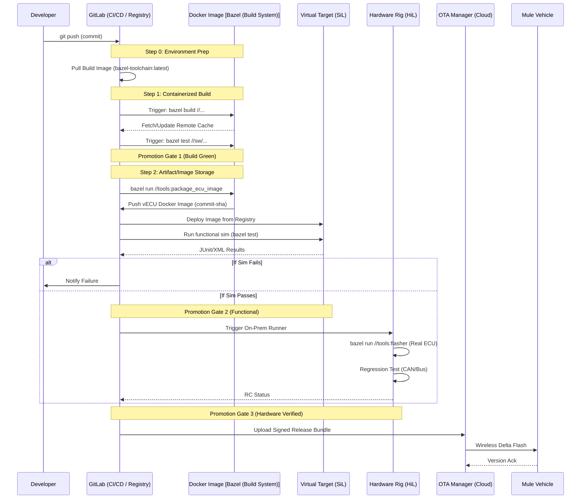

# End-to-End Automotive CI/CD

- System Definition: CI/CD is a quality system, not just automation.
- Determinism: Same inputs → same outputs; prevents "works on my machine" issues.
- Development Strategy
    - Trunk-Based Development: Relies on short-lived branches, frequent merges, and early conflict resolution.
    - Branch Management: Avoid long-lived branches; if necessary, isolate and rebase frequently.
- #Cybersecurity
    - Integrity: Artifact signing (PKI/KMS/HSM).
    - Traceability: SBOMs and build provenance.
    - Diamond Dependencies: Strategy for handling version conflicts in shared dependencies (monorepo).
    - Caching Strategy: Optimize build times using remote caching in addition to local caching.
- Metrics
    - Build Success Rate: Successful builds / Total builds.
    - Defect Escape Rate: Post-release defects / Total defects.
    - Test Metrics:
        - Code Coverage: (Covered code / Total code) × 100.
        - Requirement Coverage: Extent of requirements verified by tests.
    - Test Coverage: Scope of testing applied to the codebase.
    - Regression Rate: (Regressed tests / Previously passing tests) × 100

