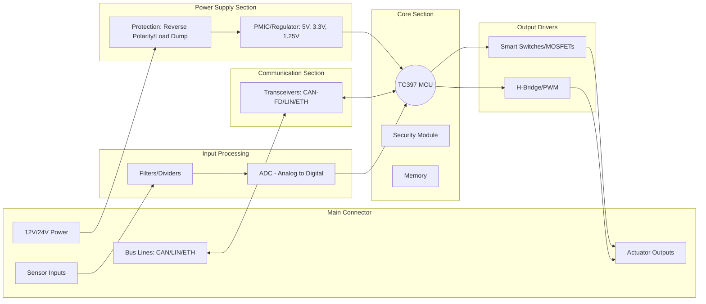

# ECU HW 

## Passive HW Components

- Capacitor: Ceramic (MLCC), 100nF–1μF, Isolation, Decoupling: Provides local "bursts" of current to the MCU, isolating high-speed switching noise from the rest of the power supply to avoid feedback.
- Capacitor: Ceramic, 1nF–100nF, Noise Kill, Filter/Bypass: Shunts high-frequency electromagnetic interference (EMI) and regulator noise to ground, acting as a low-pass filter for clean DC.
- Capacitor: Ceramic/Film, 10pF–10nF, Timing/Clock/Safety: Used as load capacitors to stabilize the crystal oscillator or in series for AC coupling to block DC while passing high-speed data.
- Capacitor: Electrolytic (Polarized +/-), 10μF–470μF, Power Buffer, Bulk/Smoothing: Acts as an energy reservoir to stabilize voltage during sudden battery dips (cranking) or heavy load activation.
- Component: Fuse (Blade or SMD), 1A–30A, Overcurrent Protection: A sacrificial wire or metal strip that melts during a short circuit, physically breaking the connection to prevent fire or total board destruction.
- Component: Quartz Crystal (XTAL), 20MHz–40MHz, Frequency Source: Provides the high-precision mechanical "heartbeat" necessary for the TC397 PLL to generate 300MHz core clocks.
- Component: Resistor Network (Array), Varies (e.g., 4x10kΩ), Signal Termination: Multiple resistors in a single SMD package used for compact pull-up/pull-down arrays on high-pin-count buses or parallel data interfaces.
- Component: Varistor (MOV/MLV), 14V–30V (Working Voltage), Surge Protection: A voltage-dependent resistor that shunts high-energy transient surges (like electrostatic discharge or inductive switching) to ground to protect the input stage.
- Diode: LED (Light Emitting Diode), Status Indicator: Low-power visual feedback component used on internal development boards or diagnostic interfaces to signal power-on, heartbeats, or fault states.
- Diode: Schottky Diode, Low Forward Voltage (0.2V–0.4V), High-Speed Switching: Used in DC-DC converters and high-frequency rectification due to its fast recovery time and lower power loss compared to standard silicon diodes.
- Diode: Standard Rectifier, Varies (e.g., 1A-5A), Reverse Polarity Protection: Acts as a one-way valve to prevent current flow and hardware destruction if the battery is connected backward.
- Diode: Zener/TVS, 12V–27V Breakdown, Overvoltage Clamping: Acts as a pressure relief valve, shunting transient voltage spikes (Load Dump) to ground to protect the 3.3V/5V logic levels.
- Inductor: Common Mode Choke (CMC), Dual-winding, Signal Integrity: Specifically used on differential pairs (CAN, Ethernet) to cancel out noise common to both lines while letting the differential data signal pass.
- Inductor: Ferrite Bead, 10Ω–1kΩ (Impedance @ 100MHz), High-Frequency "Sponge": Acts as a frequency-dependent resistor that absorbs high-frequency EMI and dissipates it as heat; used to clean power rails right before MCU pins.
- Inductor: Multi-Layer Chip Inductor, nH–μH, RF/High-Frequency Filter: Small, non-wire-wound inductors used for very high-frequency signal filtering in communication stages or RF interfaces.
- Inductor: Power Inductor (Shielded), 1μH–100μH, Energy Storage: Found in Buck/Boost converters (DC-DC) to store energy in a magnetic field during the "on" cycle and release it during "off" to maintain steady output voltage.
- Resistor: Thick Film/Thin Film, 0Ω–1MΩ, Current Limiting/Division: Used to protect sensitive MCU inputs, scale battery voltages for ADC measurement, or terminate data buses to prevent signal echoes.

## Active HW Components

- CAN/LIN Transceiver: Protocol Converter, Differential Driver, Bus Interface: Translates the logic-level bits from the MCU into the specific voltage levels required by the CAN-FD or LIN bus.
- Comparator: Threshold Detector, Zero-Crossing, Signal Monitoring: Compares two voltages and outputs a digital signal indicating which is higher; often used for over-current or over-temperature detection.
- DC-DC Switching Regulator: Buck/Boost Converter, High Efficiency, Power Conversion: Uses high-speed switching to convert battery voltage to lower levels with minimal heat loss; essential for high-power chips like the TC397.
- EEPROM / Flash Memory: External Non-volatile Storage, SPI/I2C, Data Logging: External memory chips used to store calibration data, fault codes, or "Black Box" crash data.
- Ethernet PHY: Physical Layer Transceiver, 100/1000Base-T1, Physical Interface: Converts digital data from the MCU or Switch into the electrical signals required for single-pair automotive Ethernet cabling.
- Ethernet Switch: Multi-port Gigabit Switch, RGMII/SGMII, Data Routing: Routes high-speed data packets between the TC397, the central vehicle computer, and other zone controllers.
- H-Bridge Driver: Integrated Motor Driver, Gate Control, Actuation: A dedicated IC that controls the gates of an external or internal MOSFET H-bridge for bi-directional motor control.
- Logic Gate IC: Level Shifters / Buffers, 74-Series, Logic Translation: Dedicated chips used to convert signals between different voltage domains (e.g., 5V logic to 3.3V logic).
- Microcontroller (MCU): Infineon AURIX TC397, 6-Core, ASIL-D, 300MHz, Central Brain: Executes the logic, manages all I/O, and runs safety-critical automotive software.
- MOSFET (N-Channel/P-Channel): Power Transistor, Switching/Driving, Actuator Control: A high-speed electronic switch used to control high-current loads like heaters, valves, or motors.
- Operational Amplifier (Op-Amp): Analog Signal Conditioner, Gain/Buffering, Signal Processing: Scales and filters tiny sensor voltages into a range that the TC397 ADC can accurately read.
- Smart High-Side Switch (eFuse): MOSFET + Protection Logic (e.g., PROFET), Power Distribution: An active switch that controls power to actuators while providing real-time current sensing and short-circuit protection.
- System Basis Chip (SBC) / PMIC: Integrated Power & Watchdog, Multi-rail Supply: A specialized chip (e.g., TLF35584) that provides regulated voltages to the MCU and includes an external hardware watchdog and physical layer transceivers.
- Voltage Regulator (LDO): Linear Drop-Out, Low Noise, Voltage Stability: An active component that provides a very "quiet" and stable output voltage for sensitive analog or radio-frequency circuits.

## Circuits

- Circuit: Buck Converter (Step-Down), Inductor + MOSFET + Diode + Cap, Efficiency Power Conversion: Converts 12V/24V battery voltage to 5V or 3.3V with minimal heat, essential for powering the TC397.
- Circuit: Common Mode Filter (CMF), Common Mode Choke + Capacitors, Data Integrity: Suppresses electromagnetic noise on CAN-FD and Ethernet lines without distorting the high-speed differential signal.
- Circuit: ESD Protection Array, Multiple TVS Diodes, Multi-channel Protection: Compact package of diodes placed behind connector pins to protect all data lines of a bus from static discharge.
- Circuit: Flyback/Freewheeling Diode, Diode + Inductive Load, Kickback Protection: Provides a safe path for current when an inductive field (relay/motor) collapses, preventing high-voltage destruction of drivers.
- Circuit: H-Bridge, 4x MOSFETs, Bi-directional Motor Control: Reverses polarity across a motor to control both speed and direction for actuators like window lifts or seat adjusters.
- Circuit: Input De-bouncing, RC Filter + Schmitt Trigger, Signal Cleaning: Removes mechanical "chatter" and electrical noise from physical switches before the signal reaches the MCU logic.
- Circuit: LC Filter (Inductor-Capacitor), Inductor + Capacitor, EMI/EMC Suppression: Combined stage at the main power input to block high-frequency bidirectional noise from entering or leaving the ECU.
- Circuit: Open-Drain / Open-Collector, Transistor + External Pull-up, Bus Communication: Allows multiple devices (like I2C) to share one wire; devices pull the line Low, while the resistor brings it High.
- Circuit: Pull-up / Pull-down Resistor, Resistor to Vcc/GND, Logic Stabilization: Ensures a signal line remains at a defined "High" or "Low" state when no active driver is present, preventing floating pins.
- Circuit: Resistor Divider, Two Resistors in Series, Voltage Scaling: Scales down high battery or sensor voltages to a range (0V–5V) compatible with the TC397 ADC inputs.
- Circuit: Resistor-Capacitor (RC), Resistor + Capacitor, Timing/Control: Defines intervals for hardware reset delays or defines the frequency window for watchdog monitoring.

## Spannungsversorgung

1. Bereitstellen der Betriebsspannungen für das Steuergerät (z.B. 3V, 5V bzw. 12V)
2. Entkopplung vom Fahrzeugbordnetz (Transiente Störungen, EMV-Filter)
3. Bereitstellen eines Massebezugspunkts
4. Erzeugung RESET-Signal (optional)
5. Auswerten Watch-Dog-Signal vom µP (optional)

## Mermaid

## MCU (TC379)

-*MCU → CPU Core → CPU ISA → Microarchitecture → ROM Boot Code → Firmware (incl. Bootloader) → RTOS/OS → Application**

### MCU & CPU Core

|Performance Class   |MCU Family              |Core Architecture          |Communication Capabilities             |Domain                                 |
|--------------------|------------------------|---------------------------|---------------------------------------|---------------------------------------|
|Low-End             |Microchip dsPIC33       |dsPIC DSP core             |CAN, LIN, SPI, I2C                     |Small actuators, sensors               |
|Low-End             |STM32 (A-Grade)         |ARM Cortex-M0/M3/M4/M7     |CAN, LIN, Ethernet (F-series), SPI, I2C|Body, comfort, infotainment peripherals|
|Low-End/Mid-Range   |Microchip SAM E/S/V     |ARM Cortex-M4/M7           |CAN, Ethernet, LIN                     |Body, infotainment peripherals         |
|Mid-Range           |NXP S32K                |ARM Cortex-M4/M7           |CAN-FD, LIN, Ethernet (select models)  |Body, Chassis, Zonal                   |
|Mid-Range           |ST SPC58                |PowerPC e200               |CAN, FlexRay, LIN                      |Body, Chassis                          |
|High-End            |Infineon AURIX TC2/TC3  |TriCore (multi-core)       |CAN, FlexRay, Ethernet, LIN, PSI5      |Powertrain, ADAS, Safety ECUs          |
|High-End            |Renesas RH850           |RH850 (multi-core)         |CAN, FlexRay, Ethernet, LIN            |Powertrain, Chassis, Braking           |
|High-End            |TI Hercules (TMS570)    |ARM Cortex-R5 (lockstep)   |CAN, Ethernet, LIN                     |Steering, Braking, BMS                 |
|High-End/Mid-High   |ST Stellar SR           |ARM Cortex-R52 (multi-core)|CAN-FD, Ethernet, LIN                  |Zonal, Powertrain-support ECUs         |
|SoC-Level           |NXP S32G                |Cortex-A53 + Cortex-M7     |Multi-Gig Ethernet, CAN-FD, PCIe, TSN  |Gateways, Service ECUs                 |
|SoC-Level           |Renesas R-Car           |Cortex-A57/A53 + DSP       |Ethernet, PCIe, CAN-FD, SerDes         |Cockpit, ADAS domain controllers       |
|SoC-Level (High-End)|NVIDIA Orin / Xavier    |Cortex-A78/A57 + GPU/DLA   |Automotive Ethernet, PCIe, SerDes      |ADAS/AD, AI compute                    |
|SoC-Level           |Qualcomm Snapdragon Auto|Cortex-A + DSP/GPU         |Ethernet, PCIe, SerDes                 |Cockpit, Infotainment, ADAS            |

### CPU ISA

- **ARM** → efficiency + ecosystem  
- **TriCore (Infineon)** → determinism + safety  
- **PowerPC (e200)** → classic predictability  
- **RISC-V** → openness + simplicity  
- **RH850 (Renesas)** → ultra-low power + precise real-time behavior  
- **Cortex-A (ARM Application Cores)** → high performance + rich OS support  
- **Cortex-R (ARM Real-Time Cores)** → real-time precision + safety extensions  
- **DSP Cores (TI C66x, Qualcomm Hexagon)** → signal processing + mathematical throughput  
- **GPU/AI Cores (NVIDIA, Qualcomm)** → massive parallel compute + perception workloads  
- **ARC (Synopsys, occasionally used in peripherals)** → configurable + ultra-low-power IP  

### Microarchitecture

- What It Is
  - Microarchitecture is the internal hardware design of a CPU core that defines **how instructions are executed**, independent of the ISA. 
  - It determines timing behavior, performance, determinism, and safety characteristics.
- What It Includes
  - Pipeline structure (stages, parallelism)
  - Cache and memory system (I/D-cache, TCM, prefetching)
  - Branch prediction and execution flow control
  - Execution units (ALU, FPU, DSP extensions)
  - Interrupt controller design and latency paths
  - Safety logic (lockstep, error detection)
  - Memory protection units (MPU/MMU)
  - Internal buses and interconnects
- Why It Matters
  - Determines **interrupt latency**, **WCET**, **jitter**, and real-time predictability  
  - Impacts RTOS behavior, scheduling guarantees, and context-switch time  
  - Influences safety certification (ASIL levels rely on predictable timing)  
  - Affects compiler optimizations and code placement  
  - Decides whether a core is suited for **powertrain**, **ADAS**, or **body ECU** workloads
- Practical Effect on Firmware
  - Firmware must consider cache behavior and pipeline timing  
  - Safety software depends on lockstep and error-detection features  
  - RTOS tuning requires awareness of interrupt and memory access paths  
  - Low-level HAL and drivers depend directly on the microarchitecture layout

    - HW: ECU Components (TC 379)
    - SPI, I²C -> Chip-to-Chip Communication (The "Internal" Layers)
      - If you open up an ECU (Electronic Control Unit), you won't see CAN or Ethernet *inside* the chip. You see these:
      - **I²C (Inter-Integrated Circuit):**
        - **Layer 1:** 2 wires (Data and Clock).
        - **Layer 2:** Uses a **7-bit Address** to talk to specific sensors.
      - **SPI (Serial Peripheral Interface):**
        - **Layer 1:** 4 wires. Much faster than I²C.
        - **Layer 2:** Uses a **Chip Select (CS)** wire to "point" at the device it wants to talk to.
      - | **I²C** | Bus | 7-bit Hardware Address | Simple, low pin-count |
      - | **SPI** | Point-to-Point | Physical Wire (Chip Select) | Very High Speed |
    - **DV (Design Validation):** Verifies design against requirements under worst-case conditions before SOP (stress, limits, margins).
    - **PV (Production Validation):** Confirms production-intent hardware, software, and processes meet requirements at scale (manufacturing robustness, consistency).
    - ### HW-Components
          - Core Compute
            - MCU/SoC is the brain; often multi-core with lockstep for ASIL.
            - External memory (QSPI Flash, DDR/PSRAM) used for OTA, logging, and high-level software.
          - Power & Protection
            - PMIC, DC/DCs, and LDOs generate stable rails from vehicle battery.
            - Protection covers load-dump, reverse polarity, short-circuit, and ESD.
          - Power Distribution
            - eFuses and smart switches replace classic fuses/relays.
            - Enable software-defined power control, diagnostics, and load shedding.
          - Networking
            - CAN/LIN for legacy and low-speed domains.
            - Automotive Ethernet PHYs (and sometimes switches) for high-bandwidth zonal backbones.
          - Peripherals
            - Timers/PWM, ADC/DAC, GPIO are essential for actuation and sensing.
            - PWM is generated in MCU but always drives loads via external drivers.
            - HSD (High-Side Driver): Used when the load must be ground-referenced, for safety, open-load detection, and to avoid a permanently “hot” load (e.g., lamps, valves, actuators).
            - LSD (Low-Side Driver): Used when cost, simplicity, and fast switching matter, and the load can safely be connected to VBAT (e.g., relays, solenoids, LEDs).
          - Security & Safety
            - HSM/TPM enables secure boot, key storage, and secure OTA.
            - Internal + external watchdogs and voltage/clock monitors ensure safe operation.
          - Actuation & Sensing
            - High-side/low-side drivers, H-bridges for motors, lamps, heaters.
            - Analog front-ends condition sensor signals before ADC.
          - Clocking, Debug, Mechanics
            - Oscillators and reset ICs are critical for stability.
            - JTAG/SWD used for bring-up and manufacturing.
            - EMC components and thermal design are mandatory in automotive environments.

          #### Memory

          - **MCU internal memory**
            - **Mask ROM:** Boot ROM, startup, HW self-test.
            - **Internal Flash:** Bootloader, application SW, calibration, A/B update slots.
            - **Internal SRAM:** Runtime data, stack(s), heap, OS objects.
            - **TCM (ITCM/DTCM):** Time-critical code and data.
            - **Backup / retention RAM:** Reset/sleep-retained data.
            - **HSM internal memory:** Secure ROM/RAM/Flash for keys and crypto.
            - **Cache (I/D):** Acceleration for Flash/externals.
          - **External memory**
            - **External NOR Flash (QSPI/OSPI):** Large SW images, OTA staging, logging.
            - **External NAND / eMMC / UFS:** Data storage, diagnostics, traces.
            - **External RAM (SRAM / PSRAM / DDR):** High-bandwidth buffers, Ethernet, ADAS data.
            - **External EEPROM / FRAM:** Small persistent configuration data.
          - **System & special regions**
            - **Memory-mapped peripherals:** Registers for CAN, LIN, FlexRay, Ethernet, ADC, GPIO.
            - **DMA regions:** Dedicated RAM areas for high-speed I/O.
            - **Shared / inter-core memory:** Multi-core or SoC communication.
            - **Safety & protection:** ECC regions, MPU/MMU partitions. #FuSa