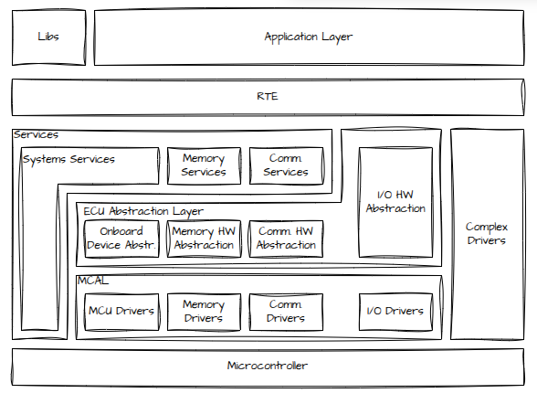

# #SWC-ARXML - AUTOSAR XML

- AUTOSAR Classic Architecture
    - SWC-ARXML: RTE + SWCs
    - BSW-ARXML: 
        - Services: System, Memory, Communication
        - ECU Abstraction: Onboard Device, Memory, Communication, I/O
        - MCAL: Drivers: MCU, Memory, Communication, I/O
        - CCD - Complex Device Drivers 
        - Implementation Metadata: Technical data for code generators, including tool versions and vendor-specific extensions.
    - ECU-Extract
        - SWCs & Ports
        - Signal-to-PDU Mapping: Defines bit-level frame layouts and transmission triggers (Cyclic/Event) for the ECU's network.
        - SWC-to-Cores/Partitions Mapping + Network channels



## Structure

- Build like a File System
    - Root: <AUTOSAR>
    - Folders: <AR-PACKAGE> -> Only for organizing
    - Content: <ELEMENTS> -> Where the actual files (SWC, Data Types, Interfaces) live


- 7 Root Folders
    - SoftwareComponents - Usage & Logic
        - ComponentTyp
            - Ports 🔗 Interfaces
            - InternalBehavior / Runnables
    - `Interfaces` - Contract 🔗 DataTypes, ModelDclGroups
        - SenderReceiver: Broadcasting
        - ClientServer: Remote Function Call
        - ModeSwitch: System State Change
    - ModeDclGroups - State Machines
    - DataTypes - Variable Structure 🔗 ComputMethod, Unit, BaseTypes
    - CompuMethods - Conversion Logic
    - Units - Physical Meaning Tags (km/h, rpm, seconds)
    - BaseTypes - Low-level Primitives (uint8, boolean, sint16)

- Identity Management
    - <SHORT-NAME> belongs to the parent tag (<AR-PACKAGE> or <ELEMENT>) - Variable names, unique, for C-Code generation
    - UUIDs (The Tooling ID): Unique 128-bit identifiers assigned to all referable objects (SWCs, Ports, Interfaces, Packages) to track identity during merging/renaming (analogy: DOORS IDs)

## Parsing

- Library: `lxml` (Fast, supports XPath)
- Handling Namespaces: Always extract the namespace URL from the root tag and map it to a prefix (e.g., 'ar').

```python
from lxml import etree
tree = etree.parse('file.arxml')
root = tree.getroot()
# Extract namespace from root tag: {http://autosar...}
ns_url = root.tag.split('}')[0].strip('{')
ns = {'ar': ns_url} # Use 'ar' prefix for all queries

```

- Traversing with XPath - XPath lets you say: "Find all tags named X, anywhere in the tree."
    - Find all SWCs: tree.xpath('//ar:APPLICATION-SW-COMPONENT-TYPE', namespaces=ns)
    - Find Ports inside an SWC: swc.findall('ar:PORTS/ar:R-PORT-PROTOTYPE', namespaces=ns)
    - Extract Reference Path: port.find('ar:REQUIRED-INTERFACE-TREF', namespaces=ns).text

## Checker Logic

- Gatekeeper (Syntax): Fast, catches 50% of errors
    - **XML Schema (`.xsd`):** Valid tags and attributes?
    - **AUTOSAR Version:** Does `xmlns` match tool expectation?
    - **Package Hierarchy:** Has `<AR-PACKAGE>` nesting?
- Unit Test (Local Consistency)
    - **ShortName:** Follows C-identifier rules (no spaces)?
    - **UUID Uniqueness:** Are all UUIDs unique?
    - **Range Checks:** `InitValue` within data type limits?
- Integration Test (Reference Linking, System Logic): Slowest, but catches the critical architectural bugs
    - **Path Existence:** Do `*_TREF` paths (e.g., `/Interfaces/Speed`) actually exist? (The "Dangling Reference" check).
    - **Type Compatibility:** Does a Port reference an Interface?
    - **Direction Mismatch:** No P-Port to P-Port connections?

## Code Snippets

### Find all Application SWCs anywhere in the file

```Python
# Find all Application SWCs anywhere in the file
# Notice the 'ar:' prefix before the tag name!
swcs = tree.xpath('//ar:APPLICATION-SW-COMPONENT-TYPE', namespaces=ns)

for swc in swcs:
    # Use .find() for direct children
    name = swc.find('ar:SHORT-NAME', namespaces=ns).text
    print(f"Found SWC: {name}")

```

### Port Reference Check

- Checking port references
  - Finds a Port.
  - Reads the "Target Path" (the TREF).
  - Checks if that Target actually exists.

```Python
def check_port_references(tree, ns):
    # 1. Find all Ports (Input and Output)
    # We use .// to search recursively from root
    all_ports = tree.xpath('//ar:R-PORT-PROTOTYPE | //ar:P-PORT-PROTOTYPE', namespaces=ns)
    
    for port in all_ports:
        port_name = port.find('ar:SHORT-NAME', namespaces=ns).text
        
        # 2. Extract the Interface Reference
        # Note: The tag name differs slightly for R vs P ports, 
        # but let's assume we are looking for a Required Interface here.
        ref_tag = port.find('ar:REQUIRED-INTERFACE-TREF', namespaces=ns)
        
        if ref_tag is not None:
            target_path = ref_tag.text # e.g., "/Interfaces/VehicleSpeed"
            
            # 3. VERIFY THE TARGET
            # We convert the AUTOSAR path to an XPath query.
            # Logic: Find an element where the absolute path matches.
            # This is tricky! A simpler way is to find the element by SHORT-NAME 
            # if you assume unique names, but the robust way is path traversal.
            
            # Let's verify existence:
            exists = find_element_by_autosar_path(tree, target_path, ns)
            
            if not exists:
                print(f"[ERROR] Port '{port_name}' points to missing interface: {target_path}")
            else:
                print(f"[OK] Port '{port_name}' linked verified.")

def find_element_by_autosar_path(tree, path, ns):
    # "Path" looks like: /Engine/Wipers/WiperSWC
    # We split this string and traverse the XML tree step-by-step
    parts = path.strip('/').split('/')
    
    current_element = tree.getroot() # Start at <AUTOSAR>
    
    for part in parts:
        # Look for a child (Package or Element) with this SHORT-NAME
        # XPath explanation: Look for any child (*) that has a SHORT-NAME equal to 'part'
        found = False
        for child in current_element:
            name_tag = child.find('ar:SHORT-NAME', namespaces=ns)
            if name_tag is not None and name_tag.text == part:
                current_element = child
                found = True
                break
        
        if not found:
            return False # Broken link!
            
    return True # Found the final item

```

## Example SWC-ARXML

```XML
<?xml version="1.0" encoding="UTF-8"?>
<AUTOSAR xmlns="http://autosar.org/schema/r4.0" xmlns:xsi="http://www.w3.org/2001/XMLSchema-instance" xsi:schemaLocation="http://autosar.org/schema/r4.0 AUTOSAR_4-2-2.xsd">

  <AR-PACKAGES>
  
    <AR-PACKAGE UUID="pkg-base-001">
      <SHORT-NAME>BaseTypes</SHORT-NAME>
      <ELEMENTS>
        <SW-BASE-TYPE UUID="bt-uint8">
          <SHORT-NAME>uint8</SHORT-NAME>
          <BASE-TYPE-SIZE>8</BASE-TYPE-SIZE>
          <BASE-TYPE-ENCODING>NONE</BASE-TYPE-ENCODING>
        </SW-BASE-TYPE>
        <SW-BASE-TYPE UUID="bt-bool">
          <SHORT-NAME>boolean</SHORT-NAME>
          <BASE-TYPE-SIZE>8</BASE-TYPE-SIZE> <BASE-TYPE-ENCODING>BOOLEAN</BASE-TYPE-ENCODING>
        </SW-BASE-TYPE>
      </ELEMENTS>
    </AR-PACKAGE>

    <AR-PACKAGE UUID="pkg-units-001">
      <SHORT-NAME>UnitsAndMethods</SHORT-NAME>
      <ELEMENTS>
        <UNIT UUID="unit-kmh-001">
          <SHORT-NAME>KmPerHour</SHORT-NAME>
          <DISPLAY-NAME>km/h</DISPLAY-NAME>
        </UNIT>
        <COMPU-METHOD UUID="cm-lin-001">
          <SHORT-NAME>Linear_OneToOne</SHORT-NAME>
          <COMPU-INTERNAL-TO-PHYS>
            <COMPU-SCALES>
              <COMPU-SCALE>
                <LOWER-LIMIT INTERVAL-TYPE="CLOSED">0</LOWER-LIMIT>
                <UPPER-LIMIT INTERVAL-TYPE="CLOSED">255</UPPER-LIMIT>
                <COMPU-RATIONAL-COEFFS>
                  <COMPU-NUMERATOR><V>0</V><V>1</V></COMPU-NUMERATOR>
                  <COMPU-DENOMINATOR><V>1</V></COMPU-DENOMINATOR>
                </COMPU-RATIONAL-COEFFS>
              </COMPU-SCALE>
            </COMPU-SCALES>
          </COMPU-INTERNAL-TO-PHYS>
        </COMPU-METHOD>
      </ELEMENTS>
    </AR-PACKAGE>

    <AR-PACKAGE UUID="pkg-modes-001">
      <SHORT-NAME>ModeDclGroups</SHORT-NAME>
      <ELEMENTS>
        <MODE-DECLARATION-GROUP UUID="mdg-veh-mode">
          <SHORT-NAME>VehicleModeGroup</SHORT-NAME>
          <INITIAL-MODE-REF DEST="MODE-DECLARATION">/ModeDclGroups/VehicleModeGroup/OFF</INITIAL-MODE-REF>
          <MODE-DECLARATIONS>
            <MODE-DECLARATION UUID="md-off"><SHORT-NAME>OFF</SHORT-NAME></MODE-DECLARATION>
            <MODE-DECLARATION UUID="md-on"><SHORT-NAME>ON</SHORT-NAME></MODE-DECLARATION>
            <MODE-DECLARATION UUID="md-drive"><SHORT-NAME>DRIVE</SHORT-NAME></MODE-DECLARATION>
          </MODE-DECLARATIONS>
        </MODE-DECLARATION-GROUP>
      </ELEMENTS>
    </AR-PACKAGE>

    <AR-PACKAGE UUID="pkg-types-001">
      <SHORT-NAME>DataTypes</SHORT-NAME>
      <ELEMENTS>
        <IMPLEMENTATION-DATA-TYPE UUID="dt-speed-001">
          <SHORT-NAME>VehicleSpeed_T</SHORT-NAME>
          <CATEGORY>VALUE</CATEGORY>
          <SW-DATA-DEF-PROPS>
            <SW-DATA-DEF-PROPS-VARIANTS>
              <SW-DATA-DEF-PROPS-CONDITIONAL>
                <BASE-TYPE-REF DEST="SW-BASE-TYPE">/BaseTypes/uint8</BASE-TYPE-REF>
                <COMPU-METHOD-REF DEST="COMPU-METHOD">/UnitsAndMethods/Linear_OneToOne</COMPU-METHOD-REF>
                <UNIT-REF DEST="UNIT">/UnitsAndMethods/KmPerHour</UNIT-REF>
              </SW-DATA-DEF-PROPS-CONDITIONAL>
            </SW-DATA-DEF-PROPS-VARIANTS>
          </SW-DATA-DEF-PROPS>
        </IMPLEMENTATION-DATA-TYPE>

        <IMPLEMENTATION-DATA-TYPE UUID="dt-bool-001">
          <SHORT-NAME>WiperStatus_T</SHORT-NAME>
          <CATEGORY>VALUE</CATEGORY>
          <SW-DATA-DEF-PROPS>
            <SW-DATA-DEF-PROPS-VARIANTS>
              <SW-DATA-DEF-PROPS-CONDITIONAL>
                <BASE-TYPE-REF DEST="SW-BASE-TYPE">/BaseTypes/boolean</BASE-TYPE-REF>
              </SW-DATA-DEF-PROPS-CONDITIONAL>
            </SW-DATA-DEF-PROPS-VARIANTS>
          </SW-DATA-DEF-PROPS>
        </IMPLEMENTATION-DATA-TYPE>
      </ELEMENTS>
    </AR-PACKAGE>

    <AR-PACKAGE UUID="pkg-if-001">
      <SHORT-NAME>Interfaces</SHORT-NAME>
      <ELEMENTS>
        <SENDER-RECEIVER-INTERFACE UUID="if-speed-001">
          <SHORT-NAME>Speed_If</SHORT-NAME>
          <DATA-ELEMENTS>
            <VARIABLE-DATA-PROTOTYPE>
              <SHORT-NAME>Val</SHORT-NAME>
              <TYPE-TREF DEST="IMPLEMENTATION-DATA-TYPE">/DataTypes/VehicleSpeed_T</TYPE-TREF>
            </VARIABLE-DATA-PROTOTYPE>
          </DATA-ELEMENTS>
        </SENDER-RECEIVER-INTERFACE>

        <SENDER-RECEIVER-INTERFACE UUID="if-status-001">
          <SHORT-NAME>Status_If</SHORT-NAME>
          <DATA-ELEMENTS>
            <VARIABLE-DATA-PROTOTYPE>
              <SHORT-NAME>Val</SHORT-NAME>
              <TYPE-TREF DEST="IMPLEMENTATION-DATA-TYPE">/DataTypes/WiperStatus_T</TYPE-TREF>
            </VARIABLE-DATA-PROTOTYPE>
          </DATA-ELEMENTS>
        </SENDER-RECEIVER-INTERFACE>

        <MODE-SWITCH-INTERFACE UUID="if-mode-001">
          <SHORT-NAME>VehicleMode_If</SHORT-NAME>
          <MODE-GROUP>
             <SHORT-NAME>currentMode</SHORT-NAME>
             <TYPE-TREF DEST="MODE-DECLARATION-GROUP">/ModeDclGroups/VehicleModeGroup</TYPE-TREF>
          </MODE-GROUP>
        </MODE-SWITCH-INTERFACE>
      </ELEMENTS>
    </AR-PACKAGE>

    <AR-PACKAGE UUID="pkg-swc-001">
      <SHORT-NAME>SoftwareComponents</SHORT-NAME>
      <ELEMENTS>
        
        <APPLICATION-SW-COMPONENT-TYPE UUID="swc-wiper-001">
          <SHORT-NAME>Wiper_SWC</SHORT-NAME>
          
          <PORTS>
             <P-PORT-PROTOTYPE UUID="port-wiper-stat-001">
              <SHORT-NAME>Status_Out</SHORT-NAME>
              <PROVIDED-INTERFACE-TREF DEST="SENDER-RECEIVER-INTERFACE">/Interfaces/Status_If</PROVIDED-INTERFACE-TREF>
            </P-PORT-PROTOTYPE>
            <R-PORT-PROTOTYPE UUID="port-wiper-mode-001">
               <SHORT-NAME>Mode_In</SHORT-NAME>
               <REQUIRED-INTERFACE-TREF DEST="MODE-SWITCH-INTERFACE">/Interfaces/VehicleMode_If</REQUIRED-INTERFACE-TREF>
            </R-PORT-PROTOTYPE>
          </PORTS>

          <INTERNAL-BEHAVIORS>
            <SWC-INTERNAL-BEHAVIOR UUID="ib-wiper-001">
              <SHORT-NAME>Wiper_InternalBehavior</SHORT-NAME>
              
              <RUNNABLES>
                <RUNNABLE-ENTITY UUID="run-step-001">
                  <SHORT-NAME>Wiper_Step_Runnable</SHORT-NAME>
                  <SYMBOL>Wiper_Step</SYMBOL> <MINIMUM-START-INTERVAL>0.0</MINIMUM-START-INTERVAL>
                  <CAN-BE-INVOKED-CONCURRENTLY>false</CAN-BE-INVOKED-CONCURRENTLY>
                  
                  <DATA-READ-ACCESSES>
                     </DATA-READ-ACCESSES>
                  <DATA-WRITE-ACCESSES>
                     <VARIABLE-ACCESS>
                        <SHORT-NAME>Write_Status</SHORT-NAME>
                        <ACCESSED-VARIABLE>
                           <AUTOSAR-VARIABLE-IREF>
                              <PORT-PROTOTYPE-REF DEST="P-PORT-PROTOTYPE">/SoftwareComponents/Wiper_SWC/Status_Out</PORT-PROTOTYPE-REF>
                              <TARGET-DATA-PROTOTYPE-REF DEST="VARIABLE-DATA-PROTOTYPE">/Interfaces/Status_If/Val</TARGET-DATA-PROTOTYPE-REF>
                           </AUTOSAR-VARIABLE-IREF>
                        </ACCESSED-VARIABLE>
                     </VARIABLE-ACCESS>
                  </DATA-WRITE-ACCESSES>
                </RUNNABLE-ENTITY>
              </RUNNABLES>

              <EVENTS>
                 <TIMING-EVENT UUID="evt-timer-001">
                    <SHORT-NAME>T_10ms</SHORT-NAME>
                    <START-ON-EVENT-REF DEST="RUNNABLE-ENTITY">/SoftwareComponents/Wiper_SWC/Wiper_InternalBehavior/Wiper_Step_Runnable</START-ON-EVENT-REF>
                    <PERIOD>0.01</PERIOD>
                 </TIMING-EVENT>
              </EVENTS>

            </SWC-INTERNAL-BEHAVIOR>
          </INTERNAL-BEHAVIORS>

        </APPLICATION-SW-COMPONENT-TYPE>

      </ELEMENTS>
    </AR-PACKAGE>

  </AR-PACKAGES>
</AUTOSAR>
```