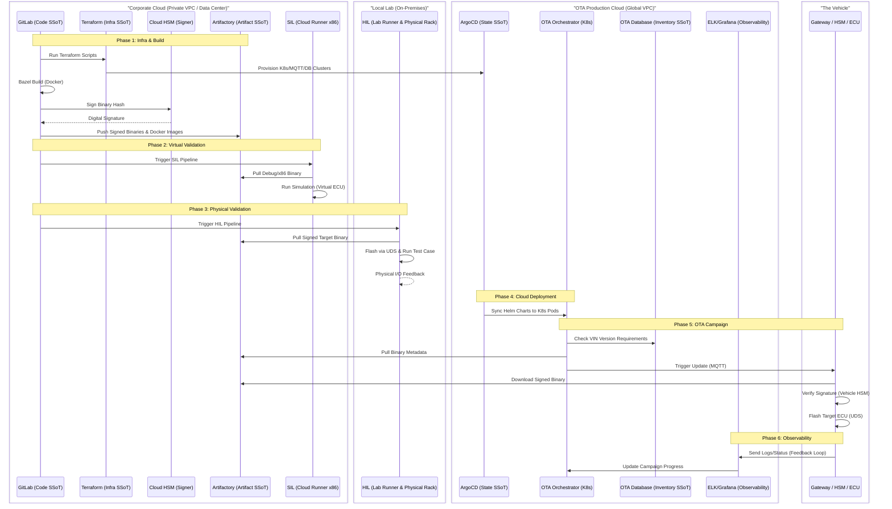

# Software Factory

- Development & Build -> Create Signed Binaries
    - GitLab (Source Code & Build Logic)
    - GitLab -> #Docker -> Bazel -> Toolchain -> Cloud HSM (Signing)
- Artifact Management -> Store Immutable Deliverables
    - Artifactory (Signed ECU Binaries & Orchestrator Docker Images)
- SIL (Software-in-the-Loop) -> Validate Application Logic at Scale
    - Artifactory (Debug/x86 Binaries)
    - GitLab Runner -> Artifactory -> Virtual ECU (x86) -> Simulation Environment
- HIL (Hardware-in-the-Loop) -> Validate Hardware-Software Interaction
    - Artifactory (Production ARM/TriCore Binaries)
    - GitLab Runner -> Artifactory -> HIL Controller -> Flash Tool (UDS) -> Lab-based ECU/Rig -> Simulated I/O
- Infra Provisioning -> Setup Cloud Resources
    - Terraform (Infrastructure as Code)
    - Terraform -> Cloud Provider (AWS/Azure/GCP) -> K8s Cluster, MQTT Broker, Databases
- Cloud Deployment -> Run the OTA Service
    - ArgoCD (Current Cloud State)
    - GitLab -> ArgoCD -> Helm -> Kubernetes (OTA Orchestrator Pods)
- OTA Orchestration -> Campaign Management
    - OTA Database (Vehicle Inventory & VIN-to-Version mapping)
    - Orchestrator -> Pulls Binary Metadata from Artifactory -> Triggers MQTT Command
- Vehicle Execution -> Securely Update Hardware
    - Vehicle HSM (Trust Root for Public Keys)
    - Gateway (MQTT) -> Flash Manager -> Vehicle HSM (Verification) -> UDS -> Target ECU
- Observability -> Monitor Fleet Health
    - ELK Stack / Grafana (Log & Metric Aggregation)
    - ECU Feedback -> Gateway -> MQTT -> Cloud Monitoring

---

## System Sequence

