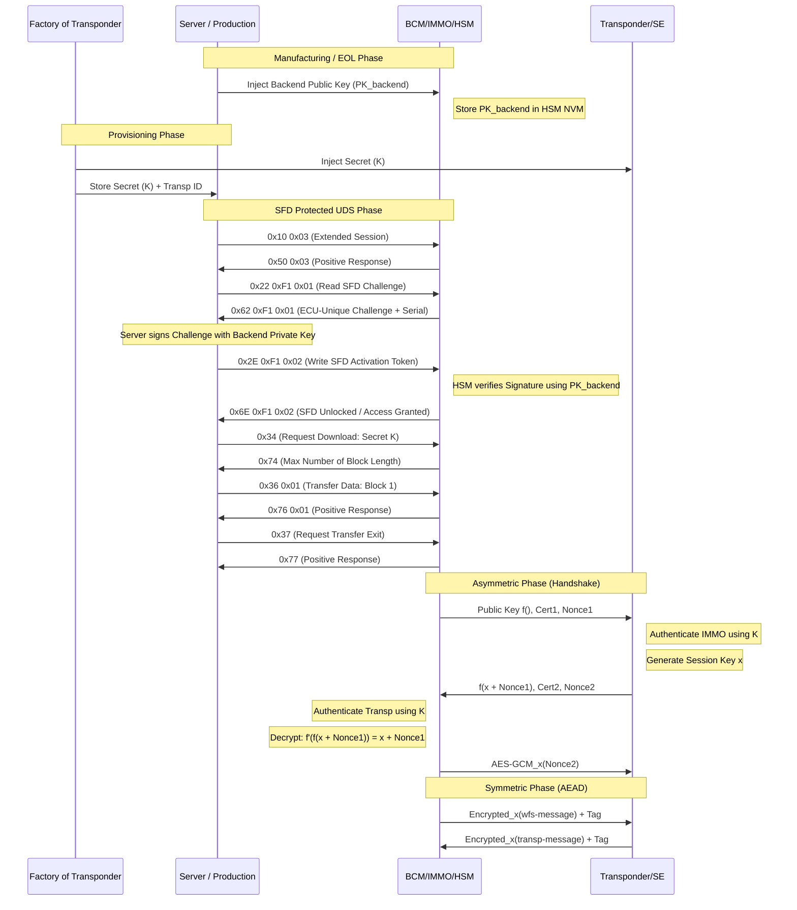

# Project IMMO - Immobilizer

- Project: WFS – Immobilizer System (Secure Vehicle Access)
- Role: Software Developer (1 yr) -> Test Manager (3 yrs)
- Scale: Full V-Model implementation (SWE.4–SWE.6), establishing complete test infrastructure from scratch for a new team.
- Core Challenge: Transforming an inexperienced team and unstructured process to achieve ASPICE Level 2 compliance under high-pressure external audit conditions.

## The Challenge - Why?

- High Security Relevance: Critical vehicle access system; failure meant theft or stranded drivers, requiring strict authorization logic.
- Process Deficit: Lacked formal testing, traceability, or automation; failed to meet industry standards.
- Audit Pressure: Urgent mandate to achieve **ASPICE Level 2** to satisfy external audit and restore customer confidence.
- Team Gap: Leading an inexperienced team while overcoming skepticism from senior developers.

## Tools

- MS Project - Planning
- DOORS Requirements
- DaVinci for #SWC-ARXML
- MATLAB/Simuling & Embedded Coder
- C code
- StarTeam (Manual Configuration with labels and baselines)
- Make + greenhill compiler -> productive
- Make + gcc -> testing
- Jenkins + groovy
- TPT
- own test tools for env, execution, reporting

## System

- [#Cybersecurity](./Cybersecurity.md)
- [#SecOC](protocols/SecOC.md)
- [#SFD](protocols/SFD.md)

### Teaching process

## Hardware

### HSM

- HSM: Acts as a powerful, programmable security co-processor with its own CPU core. It handles complex tasks like asymmetric cryptography (ECC/RSA), V2X communication, and advanced key management that SHE cannot support.
- SHE (or "HSM Light"): Handles basic 128-bit AES symmetric operations and static key storage. It is often implemented as a fixed-function hardware state machine.
- Secure Element or a dedicated Cryptographic Logic Unit: It typically supports only one or two algorithms (like AES-128 or proprietary ciphers like Hitag2) to perform the challenge-response authentication.

- **Application Core Domain (Non-Secured Space)**
  - **APP / HSM Client:** Software components (e.g., IMMO SWC) running on functional cores (Core 0 to Core N) that request security services.
  - **Core Local RAM:** Dedicated memory for each functional core used for local data processing before interfacing with security modules.
  - **COM Buffers:** Inter-process communication areas used to exchange data/requests between the functional cores and the HSM.
  - **Shared NVM:** Non-volatile memory accessible by the application cores for general data storage.
- **HSM Domain (Secured Space)**
  - **HSM Core:** A physically isolated security processor that executes cryptographic algorithms and manages keys away from the main application cores.
  - **HSM Local RAM:** Private, high-speed memory used exclusively by the HSM core for secure computations.
  - **HSM NVM:** Secure non-volatile memory used for storing sensitive assets like Master Keys and certificates that are inaccessible to the application cores.
  - **HSM Server & HSM Boot:** Specialized firmware/services running on the HSM core to handle incoming client requests and ensure a secure boot sequence for the ECU.
- **Security Boundary (Isolation)**
  - **Hardware Separation:** A hardware-enforced "Secured Space" boundary (dashed line) ensures that the application cores cannot directly access HSM internal resources.
  - **Communication Path:** Functional cores must use defined hardware bridges (COM Buffers/Shared NVM) to send "Challenges" or data for encryption/decryption to the HSM Core.

### HW Transponder Communication

- CDD: Manages non-standard timing and protocols.
- Reader IC: Bridges digital/analog signals; handles modulation/demodulation.
- Antenna Driver: Amplifies 125 kHz signal and matches impedance.
- Induction Coil: Generates EM field to power the key.
- Key's Coil: Captures inductive energy and interfaces data.
- Storage Capacitor: Stabilizes DC power for transponder logic.
- Transponder AFE: Harvests power and executes load modulation.
- Transponder Chip:
- Secure Element: Secure hardware boundary.
- Logic Unit: State machine for crypto processing.
- NVM: Tamper-resistant storage for keys/ID.

## Software

- SW Architecture
  - State machines vehicle, transponder, hsm, kessy, mdk, diagnostics, teaching process, nvm, com (CAN)
- Interface Definition: Interfaces to other SWC (MDK, Kessy), System Services (CSM), COM Stack ( #UDS , CAN, ...), Complex Device Driver (Transponder)

## Process & Workflow - Test Management

- [Test Levels](Testing.md)

- **Challenge:** Friction between Developers and new Test Team.
- **Action:** Trained team, participated in requirement reviews (preventing bugs early), and built trust by fixing broken build processes.
- **Result:** Created a sustainable validation framework used beyond the audit.

## Technical Solution - Test Levels & CI/CD

- Independent from development
- CI/CD Jenkins (jobs w. groovy on a server), tools (make, gcc compiler, python, shell scripts)
  - Setting environment
  - checkout code, tools, tests
  - building code, tests, test drivers (build via make and gcc compiler)
  - starting TPT and running testcases (incl. static tests)
  - storing log, report, metrics
    - Statement Coverage
    - Branch Coverage
    - MC/DC (Modified Condition/Decision Coverage): every condition independently affects the decision's outcome.
- Test level: SWE.4,5,6
- Independent HIL tests -> different department -> No automation
- Vehicle tests on OEM side

### Example

- Phase 0: Infrastructure & Initialization (One-time Setup)**
    - Provision virtual server/VM.
    - Install OS dependencies and core tools (`gcc`, `make`, `python`, `git`).
    - Install TPT software and configure license server connectivity.
    - Install Jenkins Agent and connect to Jenkins Master.
    - Configure Jenkins global tools, environment variables, and credentials.
- Phase 1: Pipeline Execution (Recurring)
- **Stage 1: Environment Setup & Cleaning**
    - Clean workspace (`make clean`).
    - Load environment variables.
- **Stage 2: Checkout**
    - Clone source code, test assets, and build scripts.
- **Stage 3: Static Analysis**
    - Run static analysis tools.
    - Check coding standards (MISRA).
- **Stage 4: Build & Instrument**
    - Compile code and test harness (`make`, `gcc`).
    - Instrument for coverage (Statement, Branch, MC/DC).
- **Stage 5: Test Execution (TPT)**
    - Launch TPT in batch/headless mode.
    - Execute test cases.
- **Stage 6: Reporting & Metrics Generation**
    - Generate TPT reports (HTML/XML).
    - Extract coverage data.
- **Stage 7: Archiving**
    - Store artifacts, logs, and HTML reports in Jenkins.