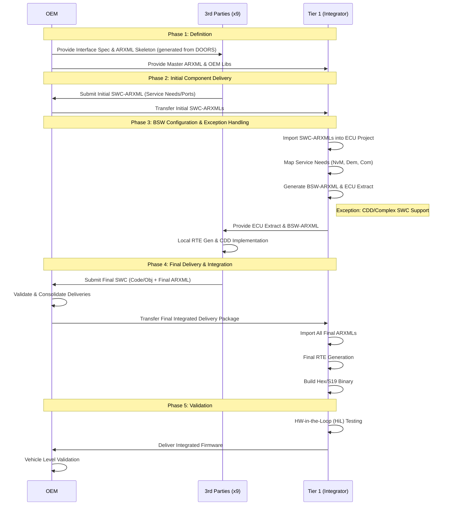

# Project #SwArchBCM

- Project: Software Architecture for Body Control Module (MQB37w/Baseline)
- Role: Project Lead
- Scale: 30+ Stakeholders (9 3rd Parties, +30 SWCs, 2x Tier1), 3-year duration
- Core Challenge: Managing chaotic interface definitions across massive distributed teams with no automated validation.

## The Challenge - Why?

- Integration Hell: Over 30 internal and external stakeholders delivering inconsistent ARXML files.
- Fragile Baseline: Frequent Change Requests (CRs) led to broken builds and "dangling references" (ports pointing to non-existent interfaces).
- Manual Overhead: No existing tooling to validate architectural consistency before the merge.

## Process & Workflow - Structured Change Management 

- The "Contract": Treated ARXML as the binding contract between 3rd parties and the integrator.
- Tooling Ecosystem:
    - Jira: Custom plugin structure for Impact Analysis. Every CR linked to specific Interface changes.
    - Bitbucket: Branching strategy (Main = Stable, Feature Branches = CRs).
    - Confluence: Single Source of Truth for process documentation and onboarding.
- Cycle:
    - Definition: OEM releases Interface Spec.
    - Delivery: Suppliers submit #SWC-ARXML
    - Validation: Your Python script validates the ARXML.
    - Integration: Merge into Master -> Generate BSW/RTE -> HiL Validation.

- branching strategy: one stable main, one branch for each CR
- #SWC-ARXML Checker 

## Technical Solution - Standalone Python #SWC-ARXML Validator

- Scope: strictly #SWC-ARXML (Software Component Description). 
- Execution: ran locally
- Logic:
  - Syntax/Schema: Validates against AUTOSAR XSD.
  - Namespace Handling: Automated namespace extraction.
  - Referential Integrity: Checked *_TREF paths within the SWC file to ensure Ports pointed to valid Interfaces.
  - Business Logic: Enforces naming conventions and InitValue checks.
- Outcome: drastically reduced "garbage in, garbage out" scenarios by rejecting invalid SWCs before attempting the complex import into the Tier 1 integration tool.
- Reference [SWC-ARXML](sw/SWC-ARXML.md)