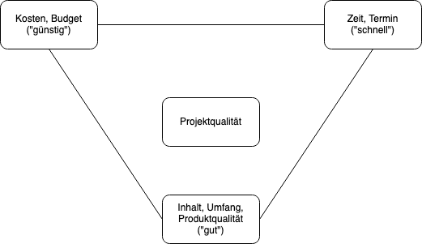

Projektstufe | Personalkosten | Komplexität IAV / Kunde
--- | --- | ---
A | Max. 4.999.999 € | 1 Abteilung / 1 OEM und kein weiterer externer Partner
B | Min 1.000.000 € Max 4.999.999 € | Min 2 Abteilungen oder 2 OEMs oder zusätzlich zum Auftraggeber 1 externer Partner
C | Ab 5.000.000 € | >80% Wertschöpfung in einem Bereich / Kein Kriterium
D | Ab 5.000.000 € | >20% Wertschöpfung in mind. 2 Bereichen oder 2 OEMs oder zusätzlich zum Auftraggeber 2 externer Partner

* Linienprojekte: A bis B
* Großprojekte: C bis D => werden von Geschäftsführung und Bereichsleiter bestätigt (-> Matrixorganisation)
* Vorhaben: nicht A bis D

## 1.2.1 Zielprioritäten / Das Magische Dreieck ("Triple Constraint")

* Nicht alle Seiten des Dreiecks können fest definiert werden => an mindestens einer Seite muss der PL managen können => Managementschenkel
* Ziele: Abstimmung zwischen PL und Sponsor
  * Inhalt und Umfang
    * Was soll geleistet bzw. nicht-geleistet werden
  * Rahmenbedingungen und Einschränkungen
    * Termine (z.B. SOP, Baustufen etc.)
    * Kostenrahmen (z.B. Festpreis, Kontingent usw.)
  * Zielhierarchie: Priorisierung der Rangfolge der Einzelziele

> Diese drei Größen stehen in einer Zielkonkurrenz zueinander, beispielsweise in folgenden Situationen:
>
> * Um den Termin zu halten, werden Überstunden geleistet und zusätzliches Personal beschäftigt; dies erhöht die Kosten.
> * Um bei einem gedeckelten Projekt die Kosten zu halten, werden Leistungen gestrichen; dies senkt die Qualität des Ergebnisses.
> * Um die Qualität des Projektergebnisses sicherzustellen, wird zusätzliche Zeit in Tests investiert und der Termin verschoben.
>
>Quelle: [wikipedia](https://de.wikipedia.org/wiki/Projektmanagement)

## 1.2.2 Zusammenhang Projekt- und Produkterfolg

Der PL ist für den Projekterfolg zuständig - der Produkterfolg liegt in anderen Händen!

 
