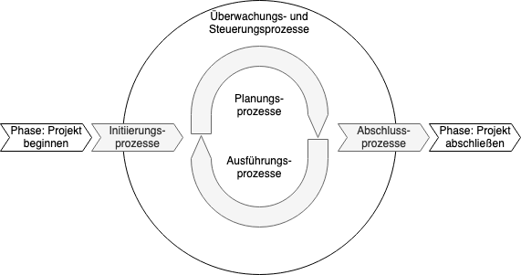

# 1.4 Leitplanken des IAV-Projektmanagements

Der IAV-Projektlebenszyklus basiert auf

* Projektmanagementstandard PMBOK des PMI;
* Automotive Spice;
* Normen und Standards
  * DIN EN ISO 9001 legt die Mindestanforderungen an ein Qualitätsmanagementsystem (QM-System) fest, denen eine Organisation zu genügen hat, um Produkte und Dienstleistungen bereitstellen zu können, welche die Kundenerwartungen sowie allfällige behördliche Anforderungen erfüllen. Zugleich soll das Managementsystem einem stetigen Verbesserungsprozess unterliegen.
  * DIN ISO/IEC 27001 spezifiziert die Anforderungen für Einrichtung, Umsetzung, Aufrechterhaltung und fortlaufende Verbesserung eines dokumentierten Informationssicherheits-Managementsystems unter Berücksichtigung des Kontexts einer Organisation. Darüber hinaus beinhaltet die Norm Anforderungen für die Beurteilung und Behandlung von Informationssicherheitsrisiken entsprechend den individuellen Bedürfnissen der Organisation.

## 1.4.1 Projektmanagement nach PMI

* Definition von Projektmanagement nach DIN 69901-5: Gesamtheit von Führungsaufgaben, -organisation, -techniken, und -mitteln für die Initiierung, Definition, Planung, Steuerung und den Abschluss von Projekten.
* Definition von Projektmanagement nach PMI: Anwendung von Wissen, Fertigkeiten, Werkzeugen und Methoden auf Projektvorgänge, um die Projektanforderungen zu erfüllen.
* Projektmanagementzyklus nach PMI:
  * Initiierung
  * Planung
  * Ausführung
  * Abschluss
  * Überwachung
  * Steuerung

## 1.4.2 Automotive-Spice

siehe SPICE-Schulung

## 1.4.3 Ausführung zu den IAV-Standards

* DIN ISO/IEC 27001:2013: Informationssicherheit
  * Vertraulichkeit
    * Sicherstellen, dass nur autorisierte Personen Zugriff auf die Informationen haben.
  * Verfügbarkeit
    * Zugriff für autorisierte Personen auf Daten muss innerhalb eines vereinbarten/ akzeptablen Zeitrahmens gewährleistet werden
  * Integrität
    * Vollständigkeit und der Korrektheit der Informationen und deren Verarbeitungsmethoden.
* DIN EN ISO 9001:2008

 
