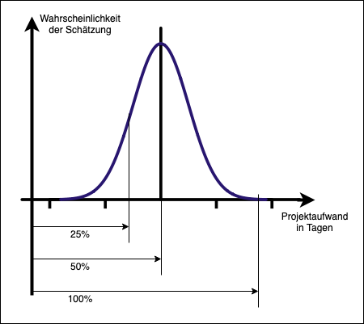

# 2.5 Schätzung und Kostenplanung

* Es gibt keine genauen Schätzungen.
* Preis ungleich Schätzung

* Top-Down-Schätzung
  * Näherung auf hohem Niveau, um z.B. Budgetentscheidungen zu treffen
  * Ungenau aber nicht aufwändig
  * Erfahrung + Feedbackschleifen
* Bottom-Up-Schätzung
  * Vorhersagen auf unterster Strukturebene (APs der WBS), zur Detaillierung der Angebote
  * Genauer aber aufwändiger
  * Bereichsschätzung (= 3-Punkt-Schätzung)
    * Optimistisch, Wahrscheinlich, Pessimistisch
* Methoden
  * Analog -  Schätzung durch Verwendung der Ist-Kosten ähnlicher Projekte/ Arbeitspakete aus der Vergangenheit (=Historische Schätzung)
  * Parametrisch - Verwendung von messbaren Größen in einem mathematischen Modell (Lines of Code etc.)
* Durchführung und Analyse einer Bottom-Up-Schätzung (Bereichsschätzung)
  1. Schätzung jeder einzelnen Aktivität
  2. Bildung eines Mittelwerts der drei Schätzwerte
      * Arithmetischer Mittelwert oder PERT Mittelwert (optimistisch+(4* wahrscheinlich)+pessimistisch)/6
  3. Bildung eines Varianzwertes aus der Bereichsschätzung
      * Varianz = ((pessimistisch - optimistisch)/6)^2
  4. Summenberechnung
      * Aufsummierung der drei Bereichswerte und des Mittelwerts
      * Summe der Varianz ergibt sich aus der Summe der Aktivitäten-Varianzen
      * Die Standardabweichung des Gesamtprojektes ergibt sich aus der Quadratwurzel der Varianzsumme (!), nicht aus der Summer der einzelnen Standardabweichungen
  5. Das Ergebnis ist nun der Mittelwert einer Normalverteilung (entspricht der Summe der Mittelwerte) sowie einer Standardabweichung dieser Normalverteilung

> * Aufwand: Kosten in Personen Jahre (PJ)
> * Dauer: Zeit
> * `Aufwand * Ressource = Dauer`
> * Aufwandsgetriebene Vorgänge: 90% aller Arbeiten
> * Dauergetriebene Vorgänge: Workshops, Dauerläufe, Schwangerschaft

 