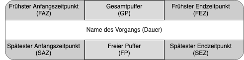

# 3.2 Die Entwicklung des Terminplanes

1. Ablaufplanung
    * Im Ablaufplan sind die Ablaufelemente - d.h. Vorgänge und Arbeitspakete unter Berücksichtigung der sachlogischen Zusammenhänge, der Randbedingungen und des Projektziels angeordnet
    * Die Ablaufplanung dokumentiert die harten Abhängigkeiten der Arbeitspakete in ihrem zeitlichen Ablauf
    * Externe Abhängigkeiten zählen zu den harten Abhängigkeiten und sind Bestandteil der Ablaufplanung
    * Die Projektaufplanung wird benötigt, um den Beginn einzelner Aktivitäten zum richtigen Zeitpunkt auszulösen und den erforderlichen Ressourcenbedarf zu planen;
    * Ein weiterer (IAV-spezifischer) Aspekt ist die Integration der Ergebnisse des Schnittstellenworkshops in die Ablaufplanung
2. Präferenzielle Logik
    * Ablaufplan wird ergänzt um "weiche" Abhängigkeiten. Diese sind frei wählbar;
3. Netzplanung / Critical Path Method
    * Aus den harten / weichen Abhängigkeiten und den für die jeweilige Dauer geschätzten Werten den frühestmöglichen Endzeitpunkt eines Projektes
    * Der Netzplan ordnet Arbeitspakete bzw. Vorgänge der WBS in ein zeitliches Ablaufschema - unter Berücksichtigung harter und weicher Abhängigkeiten
    * Grundsätzlich kann die Netzplanung als Vorwärts- oder Rückwärtsrechnung durchgeführt werden. Die Vorwärtsrechnung liefert dabei die frühest mögliche Lage der Vorgänge, während die Rückwärtsrechnung die spätest möglichen Lagen ermittelt
    * Aus den Differenzen zwischen frühsten und spätesten Lagen ergeben sich die zeitlichen Puffer für Terminverschiebungen

* Kritischer Pfad
  * Beschreibt die längste Vorgangsfolge im Netzplan, der die kürzest mögliche Projektdauer bestimmt;
  * Kritische Vorgänge ist die Bezeichnung für die Vorgänge auf dem kritischen Pfad;
  * "Near Critical" meint Pfade und Vorgänge, die nicht auf dem kritischen Pfad liegen, aber Kandidaten hierfür sind;
  * Es gibt in jedem Netzplan mindestens einen kritischen Pfad;
  * In einem Netzplan können auch mehrere kritische Pfade existieren;
  * Kritische Pfade sind nicht statistisch und können im Netzplan wechseln;
  * Auf dem kritischen Pfad gibt es keinerlei Puffer;

> Definition von Gesamtpuffer: der Zeitraum, um den ein Vorgang verzögert werden kann, ohne das Projektende zu beeinflussen (=> Nicht wirklich interessant => Zu viele beeinflussende Faktoren)

> Definition von Freier Puffer: der Zeitraum, um den ein Vorgang verzögert werden kann, ohne einen Nachfolger zu beeinflussen (=>Dieser Puffer ist entscheidend => echter Puffer!)

* Was tun wenn es länger dauert?
  * Verkürzen von Vorgängen (Crashen);
  * Das Überlappen von Vorgängen (Fast Tracking), die eigentlich eine Ende-Anfang Beziehung haben;
  * Den Termin verschieben;
  * Früher starten;
  * Präferenzielle Logik eliminieren;
  * Den Scope reduzieren;

> Merker: WBS ist Grundvoraussetzung für die Terminplanung

Kritischer Pfad: Die Methode des kritischen Pfades (auch Tätigkeits-Pfeil-Darstellung genannt; englisch critical path method, CPM) repräsentiert die Vorgangspfeil-Netzpläne, eine spezielle Netzplantechnik. Sie wurde 1956/57 vom amerikanischen Chemiekonzern DuPont de Nemours in Zusammenarbeit mit den ADV-Spezialisten Remington Rand Corp. entwickelt und auf einer UNIVAC I implementiert, um große Investitionsvorhaben sowie Instandhaltungsarbeiten bei Chemieanlagen systematisch zu planen und zu überwachen (Quelle [wikipedia](https://de.wikipedia.org/wiki/Methode_des_kritischen_Pfades)).

* Vor- und Nachteile der Netzplantechnik allgemein (Quelle [wikipedia](https://de.wikipedia.org/wiki/Methode_des_kritischen_Pfades)):
  * Vorteile
    * Zwang zum exakten Durchdenken des Projektablaufs
    * übersichtliche Darstellung der Abhängigkeiten
    * Möglichkeit der Minimierung der Projektdauer
    * höhere Sicherheit in der Termineinhaltung
    * deutliche Hervorhebung von Projektengpässen
    * Rechtzeitiges Erkennen möglicher Verzögerungen und Abschätzen von Konsequenzen
  * Nachteile:
    * Ungewissheit in der Zeitplanung
    * Vorliegen unterschiedlicher (subjektiver) Auffassungen zum Projektablauf
    * Pufferzeiten werden schnell durch Aufblähen der einzelnen Aktivitäten verbraucht

* Schritte zum Terminplan
  1. Zu leistende Arbeit => WBS
  2. Abhängigkeiten festlegen
  3. Schätzung Dauer
      * Ressourcen
      * Aufwand
  4. Terminplan fertig
  5. Terminplan optimieren

> Dauerbezogene Arbeit - nicht aufwandsgetrieben ( Schwangerschaft, Trainings …) => 10%

> Aufwandsbezogene Arbeit - erst fertig, wenn die Arbeit erledigt ist => 90%

> Regel: Wenn "Fast Tracking" beliebig funktioniert, dann gibt es keine Abhängigkeit

> Nachteil an "Fast Tracking" => Wiederholung

 