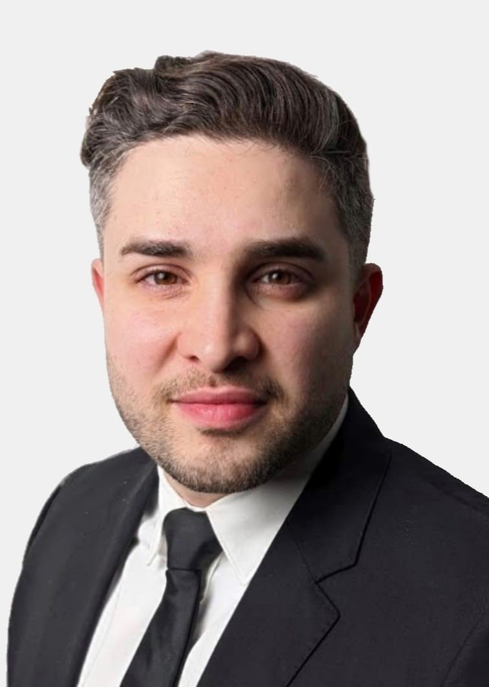

---
pdf_options:
  format: Letter
  printBackground: true
  displayHeaderFooter: true
  headerTemplate: ""
  footerTemplate: "
 | 
"
  margin:
    top: 22mm
    right: 32mm
    bottom: 18mm
    left: 22mm
---

  

    
  

  

    <h1>Mahmud Ağdaş</h1>
    
M.Sc. Electrical Engineering

  

  

    
<svg xmlns="http://www.w3.org/2000/svg" viewBox="0 0 24 24" width="11" height="11" fill="currentColor"><path d="M10 20v-6h4v6h5v-8h3L12 3 2 12h3v8z"/></svg> Kurzekampstraße 16R, 38104 Braunschweig

    
<svg xmlns="http://www.w3.org/2000/svg" viewBox="0 0 24 24" width="11" height="11" fill="currentColor"><path d="M20 4H4c-1.1 0-2 .9-2 2v12c0 1.1.9 2 2 2h16c1.1 0 2-.9 2-2V6c0-1.1-.9-2-2-2zm0 4l-8 5-8-5V6l8 5 8-5v2z"/></svg> mahmud.agdas@posteo.net

    
<svg xmlns="http://www.w3.org/2000/svg" viewBox="0 0 24 24" width="11" height="11" fill="currentColor"><path d="M6.62 10.79c1.44 2.83 3.76 5.14 6.59 6.59l2.2-2.2c.27-.27.67-.36 1.02-.24 1.12.37 2.33.57 3.57.57.55 0 1 .45 1 1V20c0 .55-.45 1-1 1-9.39 0-17-7.61-17-17 0-.55.45-1 1-1h3.5c.55 0 1 .45 1 1 0 1.25.2 2.45.57 3.57.11.35.03.74-.25 1.02l-2.2 2.2z"/></svg> +49 (0) 162 981 32 32

    
<svg xmlns="http://www.w3.org/2000/svg" viewBox="0 0 24 24" width="11" height="11" fill="currentColor"><path d="M12 2C8.13 2 5 5.13 5 9c0 5.25 7 13 7 13s7-7.75 7-13c0-3.87-3.13-7-7-7zm0 9.5c-1.38 0-2.5-1.12-2.5-2.5s1.12-2.5 2.5-2.5 2.5 1.12 2.5 2.5-1.12 2.5-2.5 2.5z"/></svg> Born June 1, 1989, in Braunschweig

    
<svg xmlns="http://www.w3.org/2000/svg" viewBox="0 0 24 24" width="11" height="11" fill="currentColor"><path d="M16 11c1.66 0 2.99-1.34 2.99-3S17.66 5 16 5c-1.66 0-3 1.34-3 3s1.34 3 3 3zm-8 0c1.66 0 2.99-1.34 2.99-3S9.66 5 8 5C6.34 5 5 6.34 5 8s1.34 3 3 3zm0 2c-2.33 0-7 1.17-7 3.5V19h14v-2.5c0-2.33-4.67-3.5-7-3.5zm8 0c-.29 0-.62.02-.97.05 1.16.84 1.97 1.97 1.97 3.45V19h6v-2.5c0-2.33-4.67-3.5-7-3.5z"/></svg> Married, 2 children (6 and 9 years old)

  

## Professional Experience

### Volkswagen AG – Electrical Systems Development (EKE)
Technical Expert | *Oct 2022 – Present*

- Software Factory SDV – Responsible for Software Build and Release.
- Anti-theft-alarm siren ECU – Responsible for component development, Tier-1 coordination, and validation.
- 48 V power supply system – Conducting evaluations, supplier workshops, and technical reporting for future architectures.
- Electronic Main Fuse Box (eHSB) – Led ECU test management across HiL, prototype, and pre-series stages.
- Zonal controller eFuse validation – Managed test planning and automation concepts for eFuses.
- Standardized test workflows and documentation, ensuring consistent verification and traceability.

### IAV GmbH – Connected Software Systems & Services
Software Project Lead / Test Manager / Software Developer | *Aug 2015 – Sep 2022*

- Body Control Module (BCM MQB37w, VW Atlas PA2) – Directed software integration and delivery processes, managed ARXML interfaces, and led U.S.-specific BCM version development under tight schedules.
- Child Presence Detection (CPD) – Led the ASPICE Level 2 software project, overseeing full lifecycle from design to vehicle validation with minimal team resources.
- BCM Software Architecture (SwArchBCM) – Developed ARXML consistency checker and standardized delivery and change-management processes across 20+ stakeholders.
- Immobilizer System (WFS) – Built test management processes from scratch, achieving ASPICE Level 2 compliance and transforming a new team into an efficient validation unit.
- Parking Coordinator (PaCo) – Implemented and demonstrated model-based prototype that secured project sourcing and later evolved into a production software component.

### Elektrobit Automotive GmbH – ECU Engineering Services
Working Student | *Apr 2013 – Sep 2014*

- Developed a CAN residual bus simulator supporting ECU validation and test automation.

### Technical University of Braunschweig – Institute of Control Engineering
Research Assistant (Student) | *Feb 2013 – Nov 2015*

- Designed and built a 1:5-scale model vehicle with torque vectoring for laboratory validation.
- Supported R&D for electric drive control systems in academic projects.

Kurzekampstraße 16R, 38104 Braunschweig &nbsp;&nbsp;&nbsp; mahmud.agdas@posteo.net &nbsp;&nbsp;&nbsp; +49 (0) 162 981 32 32

## Education

**M.Sc. Electrical Engineering**, TU Braunschweig (Grade 1.6) | *2014–2015*  
Master's Thesis (Grade 1.0)

- Single-wheel torque vectoring control for over-actuated vehicles.

**B.Sc. Electrical Engineering**, TU Braunschweig (Grade 2.8) | *2009–2014*  
Bachelor's Thesis (Grade 1.3)

- Battery management system for electric vehicles.

## Certifications & Training

|  |  |
|---|---|
| Wiring Systems Specialist | IHK \| 2023 |
| AUTOSAR Classic in Practice | Vector GmbH \| 2019 |
| Provisional ASPICE Assessor | Kugler Maag / VDA QMC \| 2019 |
| Agile Development | Kugler Maag \| 2018 |
| Project Management | Wuttke & Team \| 2018 |
| Adaptive AUTOSAR | Vector GmbH \| 2018 |
| ISTQB® Certified Tester | IAV / Cert-IT \| 2017 |
| ISO 26262 Functional Safety | IAV \| 2016 |

## Technical Skills

|  |  |
|---|---|
| Programming | C, Python |
| Model-Based Design | MATLAB / Simulink, IBM Rhapsody, Enterprise Architect |
| Version Control & CI/CD | Jenkins, GitLab, GitHub, Bitbucket |
| Requirements Management | IBM DOORS, PTC AVW |
| Testing & Validation | CANoe, PikeTec TPT |
| Project Management | Jira, Confluence, MS Project, Cplace |
| Configuration Management | StarTeam, Group DMS |
| Office & Documentation | LaTeX, MS Office |

## Language Skills

|  |  |
|---|---|
| English | Fluent |
| German | Native |
| Turkish | Native |
