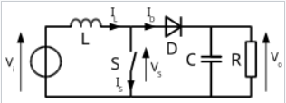
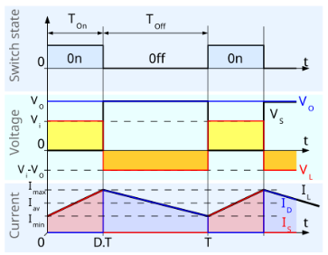
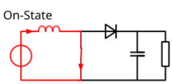
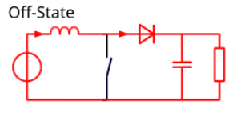

# #BoostConverter / Step Up

- Circuit: Boost Converter (Step-Up), Inductor + MOSFET + Diode + Cap, Efficiency Power Conversion: Converts a lower battery voltage (e.g., 12V) to a higher output voltage (e.g., 24V or 48V) required for specific sensors or actuators.
- Calculation: $V_{out} = \frac{V_{in}}{1 - \text{Duty Cycle}}$ , meaning the output voltage is always greater than or equal to the input voltage.
- Control: PWM (Pulse Width Modulation) timing on the MOSFET determines how much energy is "pumped" into the inductor to increase the voltage.
- Filtering/Buffering: The output capacitor maintains the high voltage level during the next "ON" cycle when the inductor is disconnected from the load.
- Efficiency: Achieves high-voltage output without the need for a transformer, minimizing space and thermal loss.

## Switch ON Mode

- Switch ON Mode: MOSFET closes, creating a short circuit path from  through the inductor to Ground.
- Energy Storage (ON): Current flows heavily through the inductor, storing energy in its magnetic field while the diode remains reverse-biased, preventing the capacitor from discharging into ground.

## Switch OFF Mode

- Switch OFF Mode: MOSFET opens, interrupting the path to ground and forcing the inductor current to find a new path.
- Voltage Boosting (OFF): The inductor’s magnetic field collapses and induces a high voltage that "stacks" on top of  to forward-bias the diode.
- Charging (OFF): The combined voltage ($V_{in} + V_{L}$) flows through the diode to charge the output capacitor and power the load.