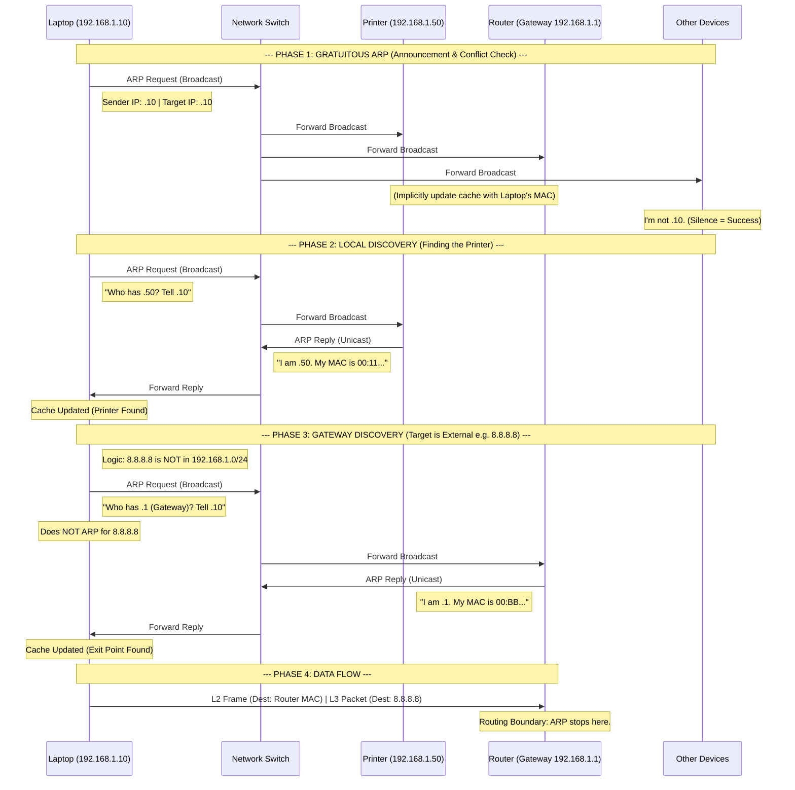

# #ARP - Adress Resolution Protocol

- Service: Mapping of dynamic L3 logical addresses (IPv4) to static L2 physical addresses (MAC).
- Transport: #OSI L2 ; EtherType 0x0806; Boundary: Limited to the LAN; routers do not forward ARP requests
- Routine: Request/Response via broadcast
    - Request: "Who has IP X? Tell IP Y" (Sent to Broadcast MAC FF:FF:FF:FF:FF:FF).
    - Response: "I have IP X, my MAC is Z" (Unicast back to the requester).
    - Gratuitous ARP: A node broadcasts its own IP/MAC mapping without being asked. Used for Conflict Detection (IP address collisions) and updating neighbor caches after a failover.
- Encapsulation: Ethernet Header + ARP Request
    - HW Type: 1 for Ethernet
    - Protocol Type: 0x0800 for IPv4
    - Operation (Opcode): Request  = 1; Reply = 2
    - Sender MAC & IP
    - Target IP
    - Target MAC: @request = 00:00:00:00:00:00
- Artifact: ARP Table (Cache): Short-term memory with TTL (Time-To-Live)
    - viewable via `arp -a` or `ip neigh`
    - Vulnerability: ARP Poisoning / Spoofing. Since ARP is a "trusting" protocol with no verification, an attacker can send fake responses to perform a Man-in-the-Middle (MITM) attack, intercepting traffic between a host and the Router.
- Mission: Enabling local delivery of IP packets; the "glue" between networking and hardware.

