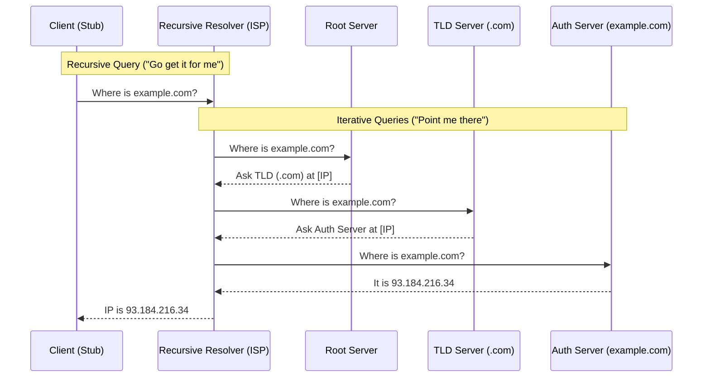

# #DNS Domain Name System

DNS is the decentralized, hierarchical "phonebook" of the internet that resolves human-readable hostnames (e.g., `google.com`) into machine-readable IP addresses (e.g., `142.250.190.46`).

- Service:
    - Mapping Resolution Name to IP-address
    - "Phone Book" Structure: Inverted Tree.
        1. Root (`.`): Managed by ICANN. 13 logical clusters. Points to TLDs.
        2. TLD (Top-Level Domain): `.com`, `.org`, `.de`. Points to Authoritative servers.
        3. Authoritative: Holds the actual records for a specific domain (e.g., `amazon.com`).
- Transport: #OSI L7, Port 53, #UDP / #TCP
- Routine
    - Recursive Query: Client $\rightarrow$ Resolver. "I want the final answer."
    - Iterative Query: Point me in the right direction
        - Client asks Recursive $\rightarrow$ Recursive walks the tree (Root $\rightarrow$ TLD $\rightarrow$ Auth) $\rightarrow$ Recursive caches answer $\rightarrow$ Returns to Client.
- Encapsulation
    - Header including RCODE
    - Sections
        - Question: Name + Type
        - Answer: The resource records (IPs)
        - Authority: Authoritative Namer Servers domain
        - Additional: Glue records (IPs of the NS Servers)
- Artifacts
    - A: Hostname -> IPv4 Address
    - AAAA: Hostname -> IPv6 Address
    - CNAME: Hostname -> Hostname (Alias)
    - MX: Domain -> Mail Server
    - NS: Domain -> Nameserver (Delegation)
    - TXT: Arbitrary text. Used for SPF/DKIM (Anti-spam) and verification
- Mission: Performance and Trust
    - Caching: The critical performance mechanism.
        - TTL (Time To Live): How long (in seconds) a resolver stores a record before discarding it. Low TTL = fast updates; High TTL = stability.
    - Reliability: Anycast routing allows multiple servers to share one IP (e.g., `8.8.8.8`) for redundancy and speed.
    - Security: DNSSEC uses cryptographic signatures to prevent cache poisoning (spoofing), ensuring the answer comes from the real origin.

## Analogy

- Core Metaphor: The Global Library System.
    - Root Server (`.`): The **Information Desk** at the entrance. They don't have the books, but they know which floor (TLD) to send you to.
    - TLD Server (`.com`): The **Librarian** for that specific floor. They don't have the book in hand, but they know exactly which shelf (Authoritative Server) it sits on.
    - Authoritative Server: The **Specific Shelf**. This is where the actual book (the IP address) resides.

## Connection

- DNS is to the Internet what a Contacts App is to a Smartphone.

## Visualization: The Routine (Recursive vs Iterative)

