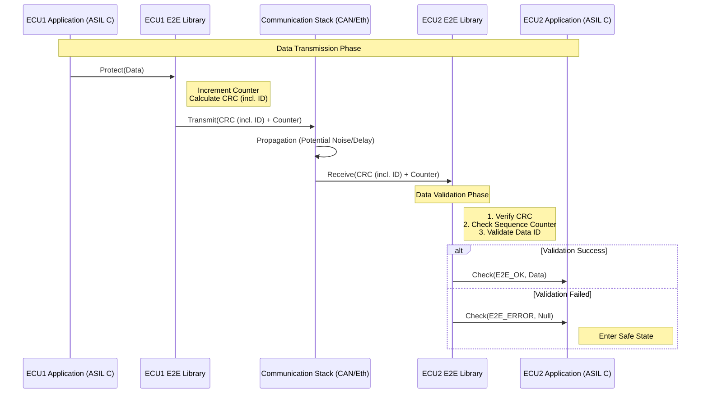

# #E2E - End-to-End Protection

- #FuSa #ISO26262
- COM-Path = Black Box -> QM (❌ #SecOC)
- E2E Header = SQC (Sequence Counter) + CRC (Cyclic Redundancy Check) (Data ID, Counter, Data) 
- State Machine (❌ #SecOC)
    - INIT (windowing: 8/10 valid to switch to valid, otherwise invalid)
    - VALID (windowing: 8/10)
    - INVALID (windowing: <8/10)

## Example Sequence

