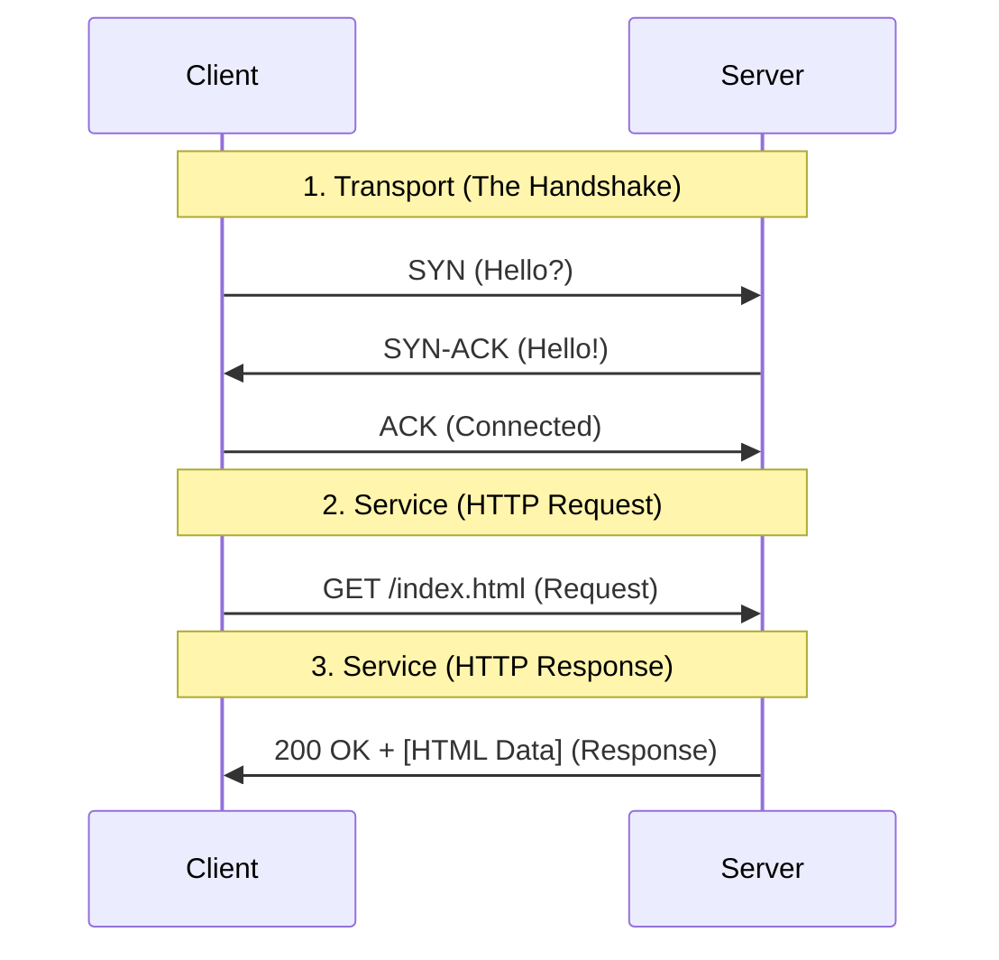

# HTTP / HTTPS - Hypertext Transfer Protocol

*HTTP is the stateless request-response language of the web (Application Layer), while HTTPS adds a security layer (TLS) to encrypt the conversation.*

- Service: Secure, encrypted data exchange between the Client and external Server.
- Transport: #OSI L7, #TCP , #IP ,
    - #HTTP Port: 80
    - #HTTPS Port: 443 + #TLS
- Routine: Verbs & Flow, stateless
    - Client HTTP-Request: Methods (Verbs)
        - `GET` -> get data
        - `POST` -> submit new data
        - `PUT` -> replace existing data
        - `DELETE` -> remove data
    - Server HTTP-Replies: Status Codes
        - `2xx` (Success): 200 OK
        - `3xx` (Redirection): 301 Moved Permanently
        - `4xx` (Client Error): 404 Not Found, 403 Forbidden
        - `5xx` (Server Error): 500 Internal Server Error
- Encapsulation:
    - Request Structure
        - Start Line: Summary, Method + Path + Version (`GET /home HTTP/1.1`)
        - Headers: Metadata (`Host`, `User-Agent`)
        - Body: Payload (JSON, XML, or Binary).
    - HTTPS -> encrypted via #TLS
- Artifacts
    - URL - Uniform Resource Locator: `https://ww.ecample.com:443/search?1q=cats`
        - Scheme: `https://`
        - Domain: `www.example.com`
        - Port: `:443`
        - Path: `/search`
        - Query String: `?q=cat`
    - Certificates: SSL / #TLS -> "ID-Card"
    - Cookies: "Memory" , tiny file
- Mission: Efficient, flexible, and secure data exchange.
    - HTTP/1.1: "Standard"
    - HTTP/2: "Highway" -> Multiplexing
    - HTTP/3: "Future" -> #UDP + QUIC

## Visualization

### Client-Server Flow (Mermaid)

