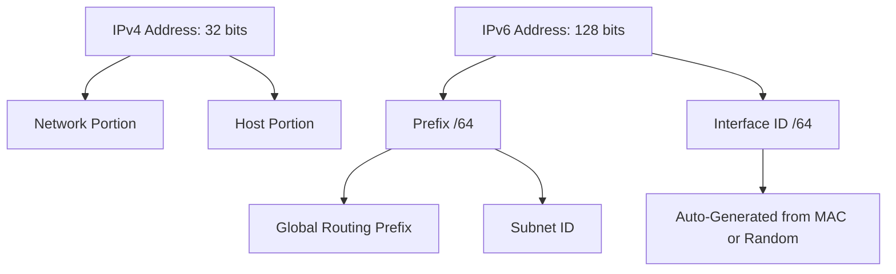

# #IP #IPv4 #IPv6

*IPv4 and IPv6 are the rules (protocols) that allow computers to find and talk to each other over the Internet*

*IPv4 is the legacy 32-bit addressing protocol relying on NAT and broadcast, while IPv6 is the 128-bit modern standard designed for infinite scale, streamlined headers, and stateless auto-configuration.*

- Service: Connectionless, Best-Effort Delivery (Fire and forget).
    - Unicast: One-To-One
    - Multicast: One-To-Many (preferred by #IPv6 )
    - Anycast: One-To-Nearest
    - Broadcast: One-To-All (Used in #IPv4, abolished in #IPv6 )
- Transport: Layer 3 #OSI
- Routine
    - Loop Prevention: #IPv4 TTL Time-To-Live & #IPv6 Hop Limit: Decrease by 1 until hitting 0
    - Address Assignment & Resolution (Routine)
        - #IPv4
            - Assignment: DHCP ("Front Desk Hotel" - distinct server)
            - Resolution: ARP ("Shouting in the Lobby" - distinct protocol)
        - #IPv6
            - Assignment: SLAAC (Powered by NDP)
            - Resolution: NDP ("The Concierge" - handles both keys and directions)
- Encapsulation
    - #IPv4 Header Variable Length + Checksum + Fragmentation -> Calculator needed (`/24`, `/26`) for host id's
    - #IPv6 Header Fixed Length (no checksum, no fragmentation) -> Fixed `/64` standard. 64 bits for Network, 64 bits for Host.
- Artifacts
    - Addresses
        - #IPv4 - x.x.x.x (x: 0-255, 8 bits)
        - #IPv6 - 128bits Hexadecimal (0-9, a-f) & zero compression (2001:db8:0:0:0:0:0:1 -> 2001:db8::1)
- Mission: Moving from scarcity (IPv4) to abundance (IPv6).
    - IPv4: Scarcity ($2^{32}$ addresses). Relies on NAT (Network Address Translation) to survive.
    - IPv6: Abundance ($2^{128}$ addresses). Restores End-to-End connectivity (No NAT needed). Future-proofing.

## Analogies (Connection & Metaphor)

|Concept            |Metaphor / Analogy|
|------------------ |------------------|
|Best-Effort Service|The Postal System: You drop a letter in the box. The post office tries to deliver it, but if a truck breaks down, they don't auto-resend it. |
|IPv4 Broadcast     |Shouting in a Room: "Is anyone here a Printer?" Everyone has to stop and listen. |
|IPv6 Multicast     |Mailing List: Only people subscribed to the "Printer" group get the message. |
|IPv4 DHCP          |Hotel Check-in: You must go to the front desk, and the clerk hands you a specific key for Room 205. |
|IPv6 SLAAC         |Festival Camping: Staff points to "Field B" (Prefix), and you pitch your tent anywhere because there's infinite space. |
|IPv4 Header        |The Over-Zealous Inspector: Weighs every package, re-tapes it, and recalculates postage at every stop. |
|IPv6 Header        |The Express Conveyor Belt: Only accepts standard boxes. Reads the label and moves it. No weighing, no re-taping. |

## Address Structure Comparison

