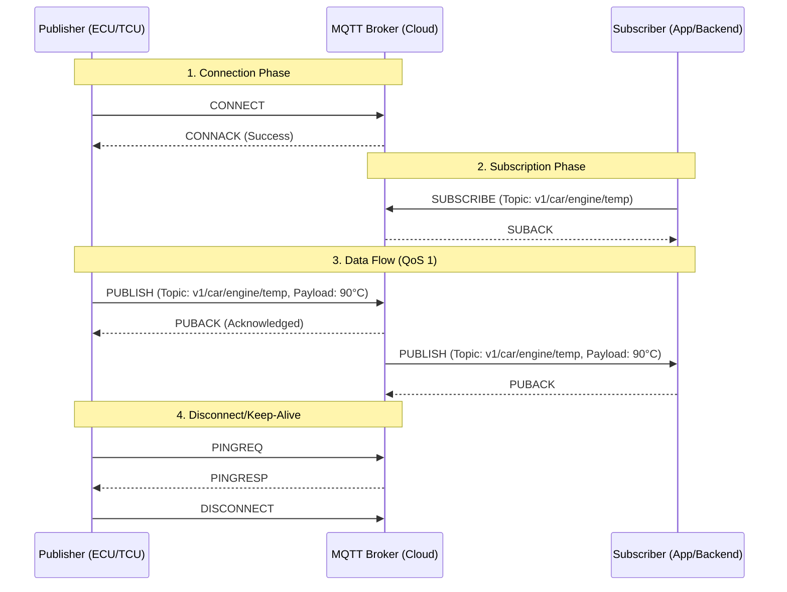

# #MQTT - Message Queuing Telemetry Transport

- Service: Lightweight telemetry and event-based messaging for external connectivity.
- Transport: L7 over #TCP (standard Ports 1883 or 8883 for #TLS ).
- Routine: Broker-based **Publish/Subscribe** mechanism.
    - Clients connect to a central **Broker**.
    - **Publishers** send data to specific "Topics" (e.g., `vehicle/vin/engine/temp`).
    - **Subscribers** receive data only from Topics they have registered for.
- Encapsulation:
    - Fixed Header (2 bytes) — Variable Header — Payload (typically **JSON** or **Protobuf**).
    - Includes **QoS** (Quality of Service) levels: 0 (Fire and forget), 1 (Acknowledged), and 2 (Exactly once).
- Artifact: Topic Tree structure and Broker URL/Credentials.
- Mission: Telematics, Vehicle-to-Cloud (V2G) communication, and remote status monitoring.

