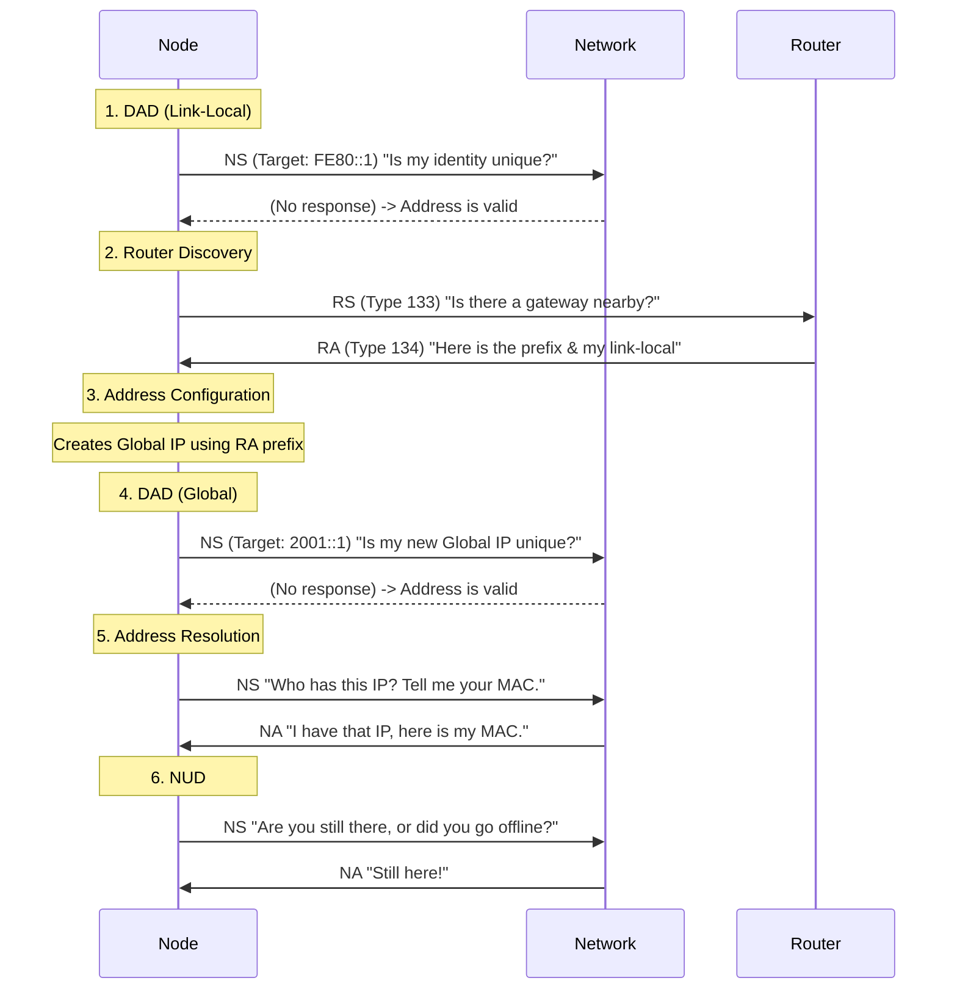

# #NDP - Neighbor Discovery Protocol

- Service: Resolves IPv6 addresses to Link-Layer (MAC) addresses, detects duplicate addresses, and finds local routers.
- Transport: OSI Level 3 - Rides on #ICMP v6 - Multicast
- Routine: 
    1. DAD (Link-Local): "Is my basic FE80 identity unique so I can start talking?"
    2. Router Discovery: "Is there a gateway nearby to give me a prefix and a route out?"
    3. Address Configuration: "I'll use that prefix to build my Global IP."
    4. DAD (Global): "Is this specific Global IP I just built unique on this network?"
    5. Address Resolution: "Who has this IP? Tell me your MAC."
    6. NUD (Neighbor Unreachability Detection): "Are you still there, or did you go offline?"
- Encapsulation: Ethernet Header (Multicast) + IPv6 Header + ICMPv6 Header + NDP Data
- Artifacts: Neighbor Cache (the IPv6 "ARP Table") and Prefix List.
- Mission: To eliminate the need for Layer 2 broadcasts and provide a plug-and-play mechanism for local network connectivity.

## The 80/20 Focus

The core 20% of NDP is Neighbor Solicitation (NS) and Neighbor Advertisement (NA). These two messages handle the vast majority of traffic by replacing the legacy ARP broadcast with efficient Multicast.

## Connection

#NDP is #ARP on steroids. It does everything #ARP did for #IPv4 , but adds the ability to find routers and check for IP conflicts automatically.

## Metaphor

## Visuals: Squence Diagram

