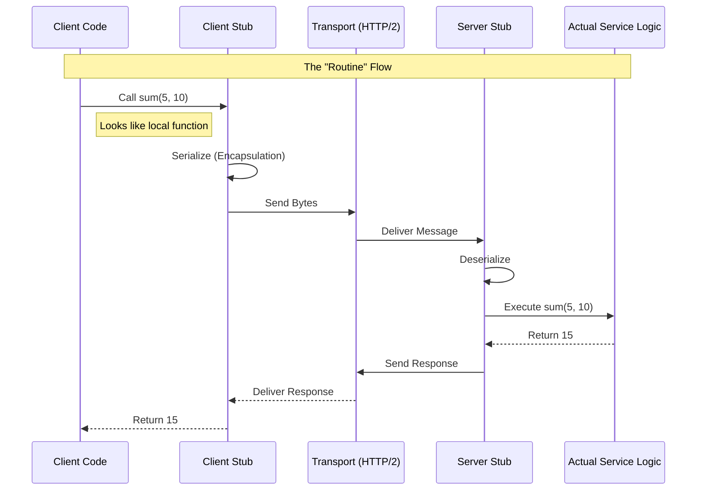

# #RPC Remote Procedure Call

*Software communication protocol that allows one program to request a service from a program located on another computer*

- Service: Remote Procedure/Function Call
- Transport:
    - Heavy Lifters: #TCP or #UDP
    - Modern standard: #HTTP /2 -> multiplexing + streaming
- Routine: Client Code → Client Stub → Network → Server Stub → Actual Function.
- Encapsulation: Serialization: Converting in-memory objects into a byte stream for transmission [text-based: JSON - readable but slow OR Binary (Compact & Fast but not readable)]
- Artifacts:
    - IDL Interface Definition Language file: contract between client and server
    - Compiling IDL file -> Code generation:
        - Classes
        - Client Stub: take parameters
        - Server Stub (Skeleton)
- Mission: Backbone of Internal Microservice
    - Pros: High performance (binary), type safety (IDL), cleaner internal code.
    - Cons: Tighter coupling than REST, requires special tools to debug.

## Visualization

