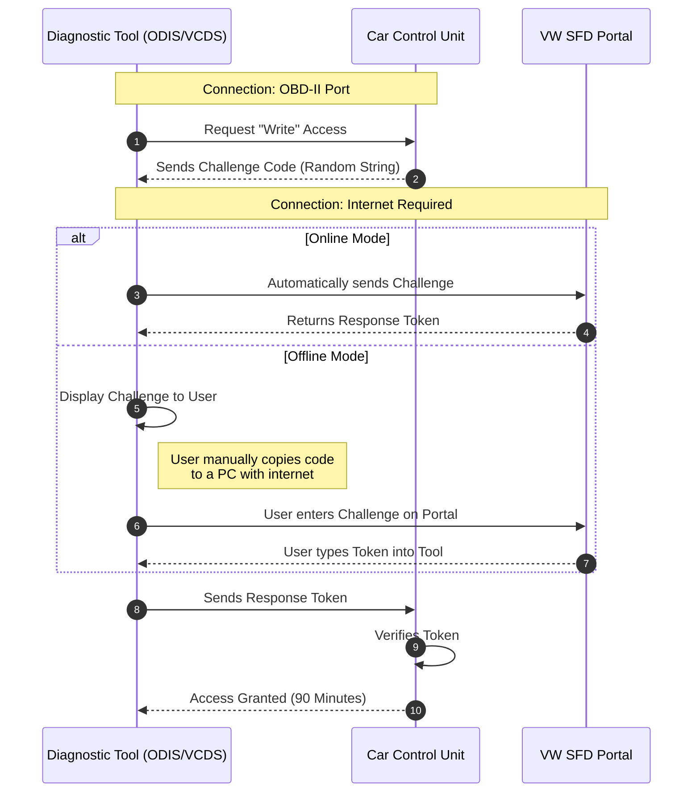

# #SFD - Sichere Fahrzeug Diagnose

- Service: #Cybersecurity #UDS Service 0x27 (Security Access).
- Transport: Operates as a sub-protocol within #UDS , typically over **CAN** or **DoIP**.
- Routine**: Asymmetric Challenge-Response with Remote Authorization (VW Backend).
    - **Step 1**: Tester requests access; ECU generates a Challenge (Random String).
    - **Step 2**: Tester sends Challenge to the OEM Portal (Server) for signing.
    - **Step 3**: Server returns a Signed Token (Response).
    - **Step 4**: ECU verifies Token using its internal Public Key.
- Encapsulation: #UDS 0x27 payloads
- Artifact:
    - Public Key injected in ECU during production
    - Private Key held by OEM Server
- Mission: Write Protection to ensure high traceability and prevent unauthorized modifications (e.g., coding/tuning).

## Workflow

