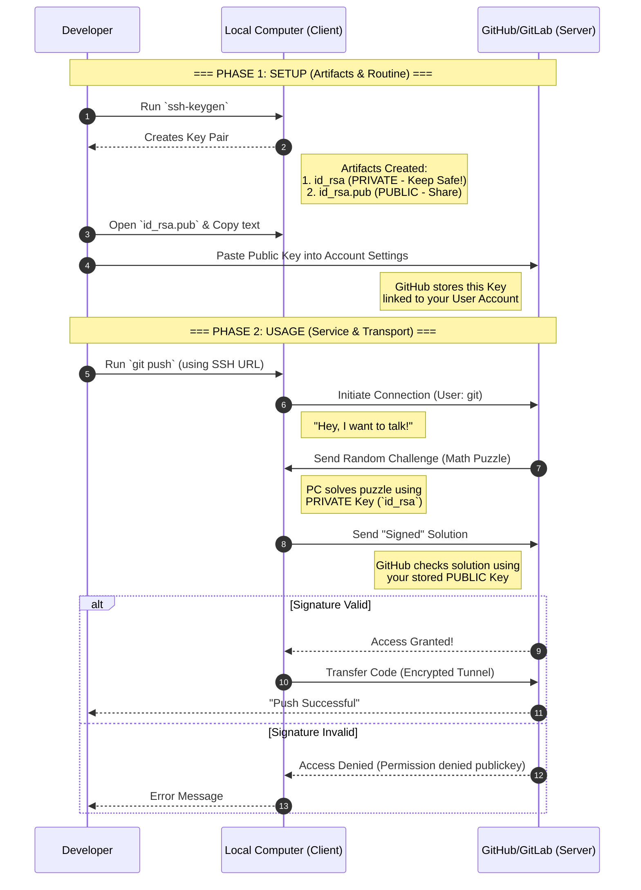

# #SSH Secure Shell

*SSH is a cryptographic network protocol that creates a secure tunnel over an unsecured network to allow safe remote command execution, file transfer, and traffic forwarding*

- Service: Provides secure Remote Shell access (CLI) and File Transfer (SCP/SFTP).
- Transport: Building secure Tunnel
    1. Protocol: #TCP , Port: 22
    2. Handshake: Algorithm Negotiation + Diffie-Hellman Key Exchange
    3. Server Identification (Host Keys)
- Routine: Public Key Authentication (Asymmetric Cryptography)
- Encapsulation:
    1. Tunneling (Port Forwarding): Wraps other traffic inside the SSH encryption.
        - Local Forwarding: Access a blocked database on a server (e.g., localhost:3306) via a local port (localhost:5000).
    2. X11 Forwarding: Runs graphical apps remotely but displays them locally.
- Artifacts: location `.ssh`
    - `id_rsa` Private Key (Top Secret). Stays on Client.
    - `id_rsa.pub` Public Key (Sharable). Copied to Servers.
    - `authorized_keys` The "Guest List" on the Server. Contains allowed Public Keys.
    - `known_hosts` The memory on the Client. Stores Server Host Key fingerprints to detect tampering.
- Mission: Hardening by Confidentiality, Integrity, Authenticity.
    - Disable Root Login (`PermitRootLogin no`).
    - Disable Passwords (`PasswordAuthentication no`).
    - Use Key-based authentication only.

## SSH Workflow GitLab/GitHub

- Step 4: This represents the "Manual Handshake" we discussed. It's the only time you manually send data to the server to set up the trust.
- Step 8 & 9: This is the Routine. GitHub sends a challenge that only your Private Key can answer.
- Step 12: The actual code transfer happens inside the secure SSH tunnel.

