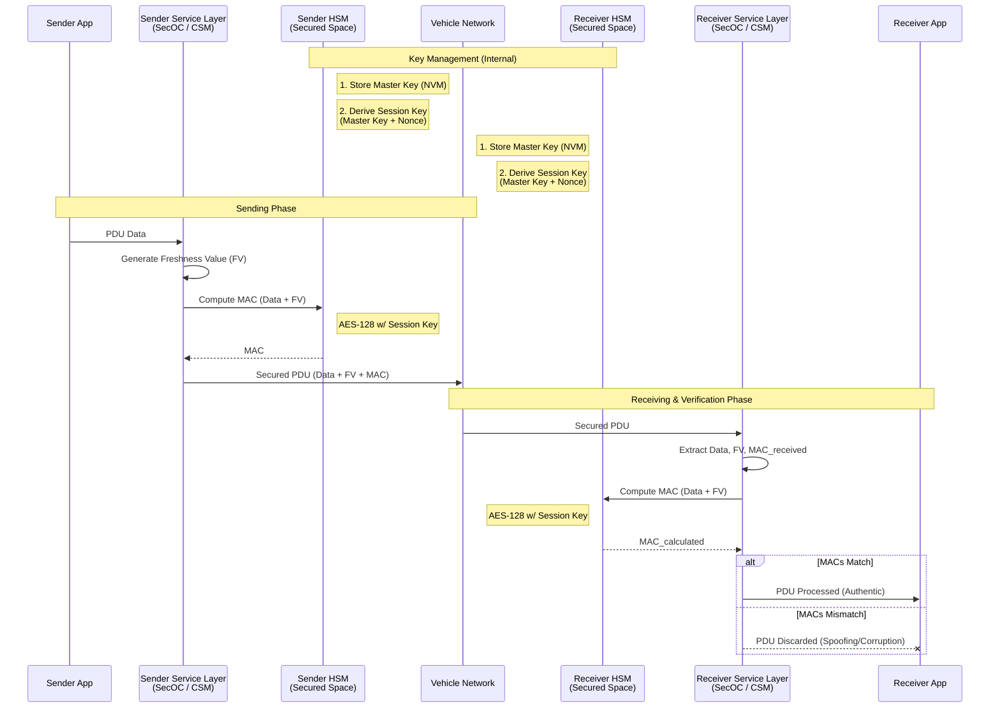

# #SecOC - Secure Onboard Communication

- #Cybersecurity #ISO21434
- COM-Path = Trusted/Authenticated Path -> Cryptographic (❌ #FuSa)
- SecOC Header = MAC - Message Authentication Code (Data + Freshness Value (FV) + Session Key)
- Key Management
    - Master Key (Long-term, injected in MFG, stored in HSM NVM)
    - Session Key (Temporary, derived in HSM via Master Key + Nonce, never transmitted)
- Execution Flow (❌ #FuSa)
    - SENDER: Service Layer (#SecOC) requests MAC from CSM -> HSM: Data + FV + SessionKey = MAC
    - RECEIVER: Calculates local MAC using local Session Key + FV; accepted only if match
    - FRESHNESS: Sync via Trip/Reset Counter to prevent Replay Attacks

