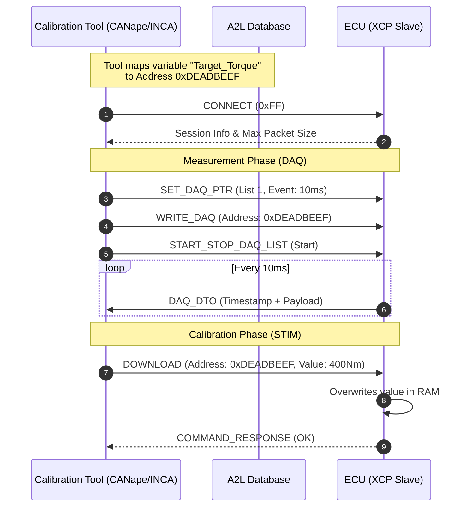

# #XCP - Universal Measurement and Calibration Protocol

- Service: High-performance internal ECU variable measurement and calibration.
- Transport: Abstraction layer that runs over #CAN #Ethernet #UDP #TCP #SPI USB
- Routine: Master (Tool) / Slave (ECU),
    - Measurement (DAQ): Periodic "Push" of memory values from ECU to Tool
    - Calibration (STIM): "Poke" or overwrite ECU RAM values to tune behavior in real-time
- Encapsulation:
    - **CTO** (Control Transmit Object): For commands, responses, and errors.
    - **DTO** (Data Transmit Object): For synchronous measurement data and stimulation data.
- Artifact: A2L File (contains memory addresses and scaling formulas )
- Mission: Real-time fine-tuning of control algorithms and signal monitoring during the R&D and vehicle testing phases.

## Workflow

